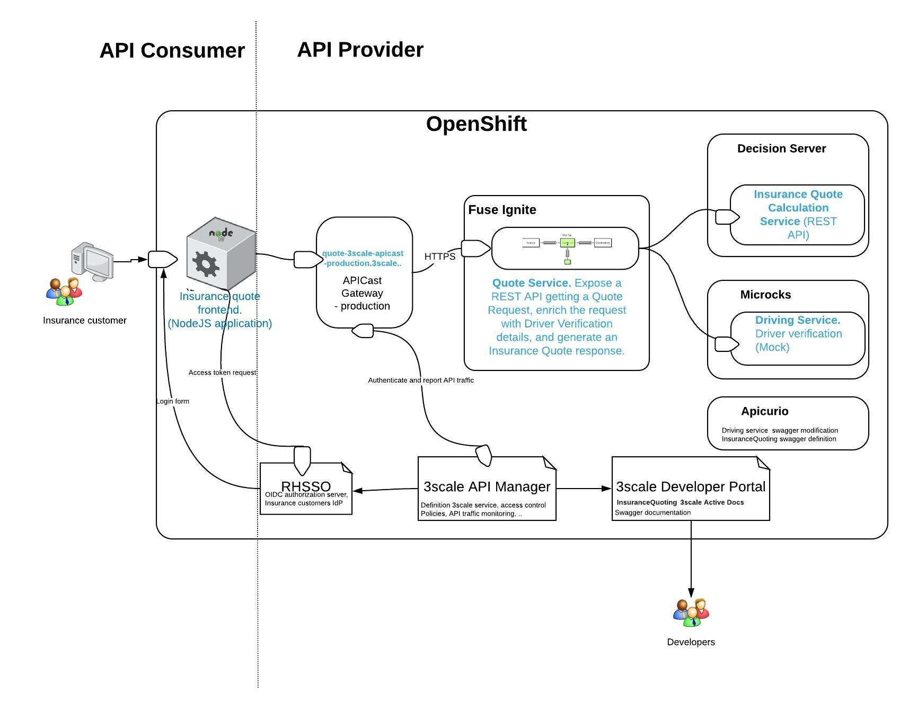
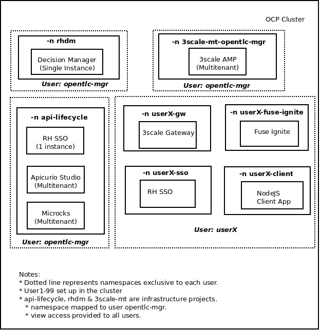

:scrollbar:
:data-uri:
:toc2:
:noaudio:

== Business Use case

ACME Insurance is a leading Motor Insurance provider globally. As part of their new IT strategy, they plan to take a microservices & REST API management approach to build their new Insurance Quotation platform. As the API Provider, ACME Insurance intends to provide a REST API for their Insurance Quote platform to their partners and customers. They want the platform to be developed using DevOps methodology, and showcasing latest design and architecture practises. 

They would like the API Manager & Integration to be hosted in a Platform-As-A-Service(PAAS) platform, so that they could choose the right cloud provider or host it inhouse.

They have invited Red Hat & Red Hat partners to showcase a solution for the above. You are to leverage Red Hat's cloud & middleware platforms, & Red Hat's recommended Agile Integration strategy to build a demo that can convince the customer about the ease of use and scalability of the solution. They have an existing QuoteEngine that runs on Red Hat Decision Manager, and have recently migrated to the latest version and hosted on OpenShift Container Platform. This quote engine requires a Driver Verification by using the public API platform from the country's Driving License Authority to determine the validity of the applicant's license and their penalty details. You are allowed to use a mockup of the public service for the demo purposes.

=== Problem Statement

Agile Integration scenario where a Fuse Ignite camel route is used to provide orchestration of 2 backend services, and expose a composite REST API on 3scale. This API is then secured with OAuth2 & OIDC using Red Hat Single Sign On (SSO) server.

Two parts:

==== Backend:

2 backend APIs in Insurance domain:
- One API for Insurance Quote calculation (REST API using Decision Manager)
- One API for Driver Verification (mock service)

1 composite API:
. Expose a REST API getting a Quote Request, enrich the request with Driver Verification details, and generate an Insurance Quote response.

API Gateway:
. Expose the composite Quote API through an API Gateway so that the service secured with OAuth2, and allow for access control & monitoring of consumers.

==== Frontend:

A simple web application providing a web interface with an application form for requesting the quote, and showing the response. All communication from frontend consumers needs to flow through the API Gateway.

=== Design

==== High Level Architecture

==== API Provider

Use Apicurio, Microcks, Fuse Ignite 3scale & SSO.

. Driving Service: https://github.com/gpe-mw-training/rhte-api-as-business-labs/blob/master/services/Driver.json
. Insurance Quote Rules Service: https://github.com/gpe-mw-training/rhte-api-as-business-labs/blob/master/services/RHDM-InsuranceQuoting.json
. Fuse Ignite Quote Service: https://github.com/gpe-mw-training/rhte-api-as-business-labs/blob/master/services/QuotingAPI.json
. 3scale API Management Platform - for API access control
. Red Hat SSO : For Open ID Connect authorization of the consumer accounts.

==== API Consumer

A NodeJS client application that provides a user authentication, and requests the Quote API exposed through 3scale. The message kicks off the backend camel route, which integrates the 2 backend API services and provides the response to the client application.

. NodeJS Application: https://github.com/gpe-mw-training/rhte-api-as-business-labs/tree/master/services/InsuranceQuoting

=== Infrastructure

All the required applications are hosted in a single OCP cluster. The deployment is as shown below:

You are provided an OpenShift cluster with all the required applications pre-installed, and the backend services available. Your task is to create the Integration API, expose it using 3scale, secure it using OIDC & Red Hat Single Sign On, and finally test the API using the API consumer.

=== Solution

You will approach the problem using the following steps:

1. Access the OpenShift Container Platform
2. Create & test the backend services
3. Create Integration route to orchestrate the backend services
4. Create API Management configuration & Open ID Connect (OIDC) setup
5. Deploy the client application and test your solution

