:noaudio:
:scrollbar:
:data-uri:
:toc2:
:linkattrs:

= Lab Setup

.Prerequisites
.. `ssh` utility installed on your laptop
.. Web browser installed on your laptop
.. broadband internet connectivity

:numbered:

== Overview

This first lab orients you with the course lab assets provided to you.

Your lab environment consists of the following:

. *Remote Virtual Machine*
+
Accessible via the ssh protocol.
This is a client VM with the *oc* client and required tools pre-installed. You can use this remote VM to run the commands shown in the labs.

. *OpenShift Master*
+
Accessible via browser or *oc* command utility.
This is the OpenShift Platform where the lab assets will be deployed.

== Access Course VM via `GUID Grabber`

This section of the lab explains how to access the Red Hat Tech Exchange _GuidGrabber_ in order to obtain a GUID.
This GUID will be used to access the lab environment.

. Begin by going to http://bit.ly/rhte-guidgrabber
+
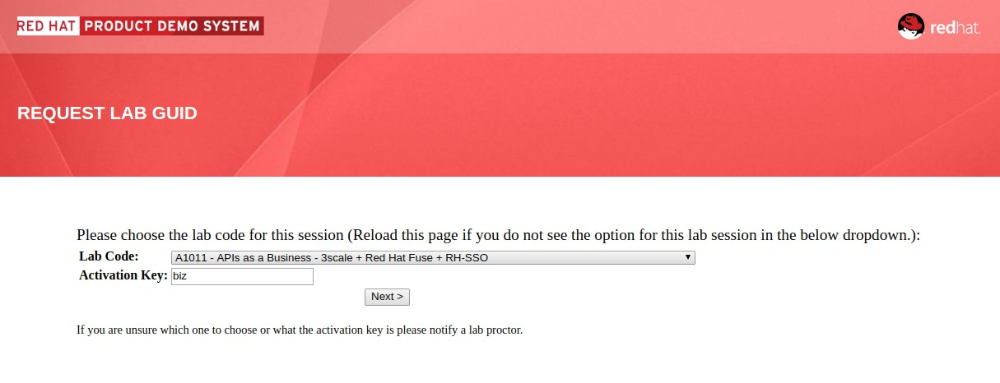

. From this page select the *Lab Code* :  _A1011_

. Enter the *Activation Key* provided by the lab instructor.

. Click *Next*.

. The resulting page will display your lab's GUID and other useful information about your lab environment.
+
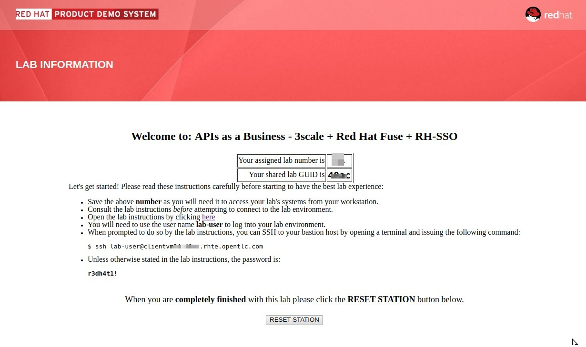

. Your remote virtual machine is accessible via the `ssh` protocol.
+
Follow the directions exactly as indicated in the Guid Grabber Information Page to ssh into your remote lab VM.

. When you are completely done with your lab environment at the end of this course, please click *Reset Workstation* so that you can move on to the next lab.
If you fail to do this, you will be locked into the GUID from the previous lab.
+
[NOTE]
Clicking *Reset Workstation* will not stop or delete the lab environment.

== Environment Variables

Once you've ssh'd into your remote terminal window, you'll want to set the following environment variables:

-----
#  Using the above variables, copy & paste the following in the same terminal #

echo "export LAB_CODE=a1011" >> ~/.bashrc
echo "export OCP_USERNAME=userX" >> ~/.bashrc
echo "export OCP_PASSWD=r3dh4t1!" >> ~/.bashrc
echo "export OCP_REGION=`echo $HOSTNAME | cut -d'.' -f2`" >> ~/.bashrc
echo "export OCP_DOMAIN=$OCP_REGION.rhte.opentlc.com" >> ~/.bashrc

source ~/.bashrc

-----

NOTE: Your userid for logging on to the OCP server.

== OpenShift Container Platform

Your lab environment is built on Red Hat's OpenShift Container Platform.

Access to your OCP resources can be gained via both the `oc` utility as well as the OCP web console.

. Using the `oc` utility, log into OpenShift
+
-----
oc login https://master.$DOMAIN:443 -u $OCP_USERNAME -p $OCP_PASSWD
-----

. Ensure that your `oc` client is the same minor release version as the server:
+
-----
oc version
-----

* You should see:
+
-----
oc v3.9.40
kubernetes v1.9.1+a0ce1bc657
features: Basic-Auth GSSAPI Kerberos SPNEGO

Server https://master.f72e.rhte.opentlc.com:443
openshift v3.9.40
kubernetes v1.9.1+a0ce1bc657

-----

.. In the above example, notice that version of the `oc` client is of the same release as the remote OCP master API.
.. There a known subtle problems with using a version of the `oc` client that is different from your target OpenShift server.

== View OpenShift Web Console

. Log into OpenShift Web Console
.. Many OpenShift related tasks found in this lab can be completed in the Web Console (as an alternative to using the `oc` utility).
.. To access the OCP web console, point your browser to the output of the following:
+
-----
echo -en "\n\nhttps://master.$OCP_DOMAIN:443\n\n"
-----
+
NOTE: If your web browser prompts about `connection privacy / security`, select `Advanced` and continue.
+
.. Authenticate using the values of `userX` and `r3dh4t1!`
+
NOTE: Replace userX with your actual userid.

Notice that you are provided with access to the following OpenShift projects:

. *lab-infra*
. *rhdm*
. userX-gw
. userX-sso
. userX-fuse-ignite
. userX-client

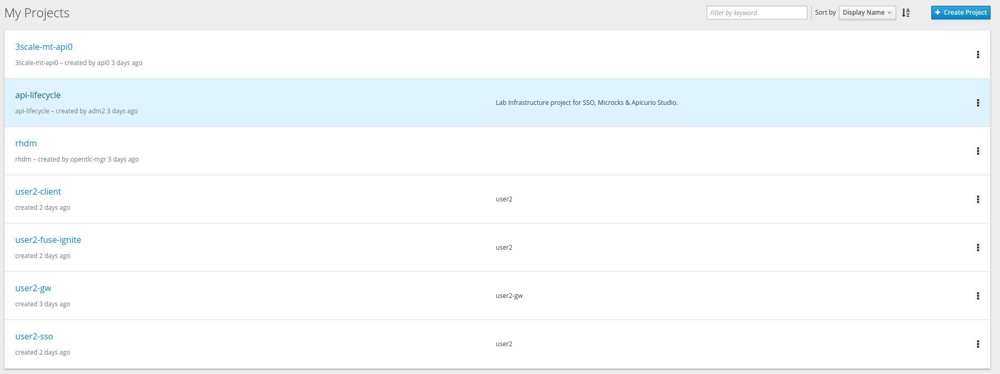

NOTE: The first 2 projects: lab_infra & rhdm are global projects for which view access has been provided to you. The projects with your userId prefix are provisioned for your exclusive use.

== Login to Applications

You have been provided with the following applications pre-installed in the lab. Please follow the below steps to ensure you are able to access each of the applications correctly. This is essential in order to work on the labs.

=== Microcks

Microcks is an open-source communication and runtime tool for developing API service mocks. It helps you create API and Service contracts, write request/response, and create ready-to-use mocks which can be served from the microcks server.

More information here: http://microcks.github.io

A single instance of *Microcks* is installed in the OCP cluster. You can access the microcks URL by navigating to the following URL in the browser: http://microcks.apps.$OCP_DOMAIN

. Open the microcks URL in a browser. You should be redirected to the login page.
. Click on *OpenShift v3" login.
+
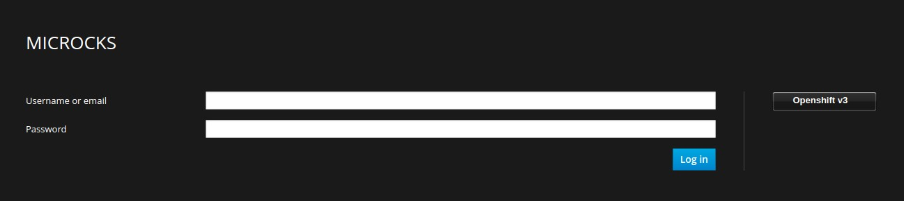

. You will be redirected to the OpenShift login page. Provide your OCP_USERNAME and OCP_PASSWD to login.
+
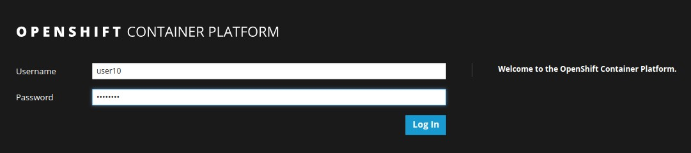

. On successful login, you need to Authorize Access to your profile for SSO. Click on *Allow Selected Permissions*.
+
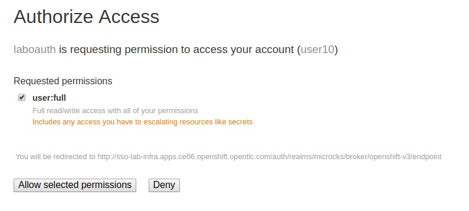

. Provide additional account information. You can provide your personal details, or choose to provide dummy details. Click on *Submit* button.
+
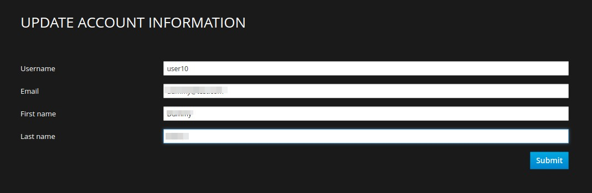

. Now you should get redirected to the home page of Microcks. Click on *Services*.
+
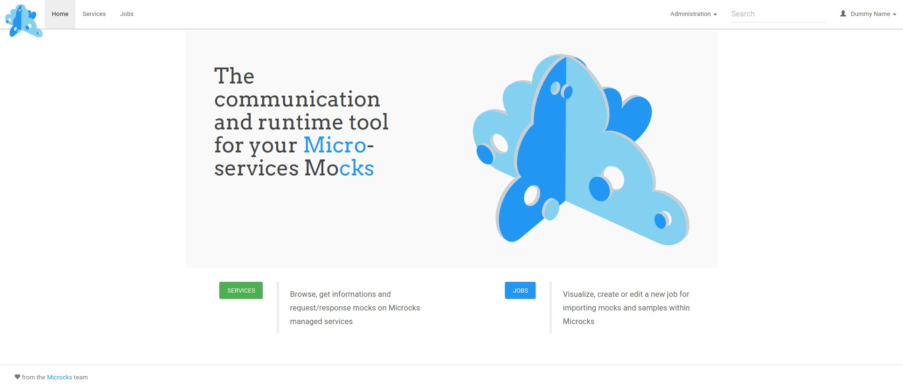

. You should see a service called *Driver Service* configured. 
+
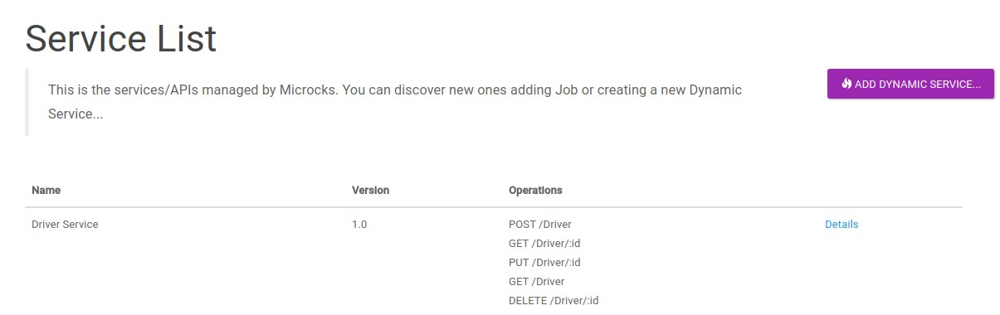

Congratulations, your Mickrocks application is set up correctly. Please keep this window open for use later in the lab.

=== Apicurio

Apicurio studio is an opensource standalone API design studio that can be used to create new or edit existing API designs (using the OpenAPI specification).

More Information here: https://github.com/Apicurio/apicurio-studio

A single instance of *Apicurio* is installed in the OCP cluster. You can access the apicurio URL by navigating to the following URL in the browser: http://apicurio-studio.apps.$OCP_DOMAIN

. Open the apicurio URL in a browser. You should be redirected to the login page.
. Click on *OpenShift v3" login.
+
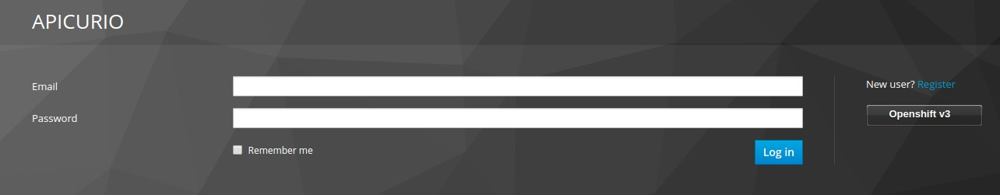

. You will be redirected to the OpenShift login page. Provide your OCP_USERNAME and OCP_PASSWD to login.
+
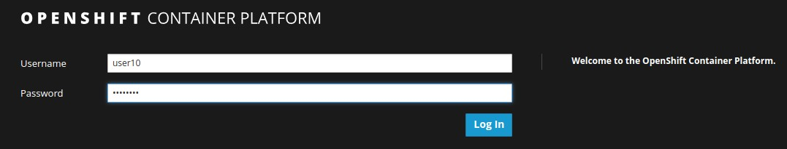

. On successful login, you need to Authorize Access to your profile for SSO. Click on *Allow Selected Permissions*.
+
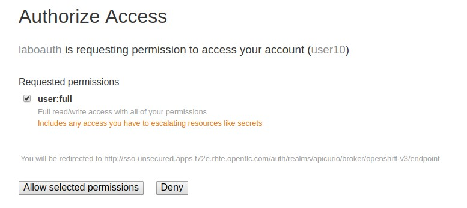

. Provide additional account information. You can provide your personal details, or choose to provide dummy details. Click on *Submit* button.
+
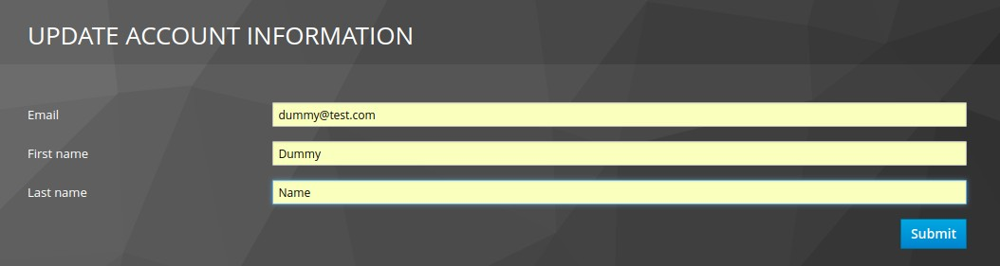

. Now you should get redirected to the home page of Apicurio Studio. 
+
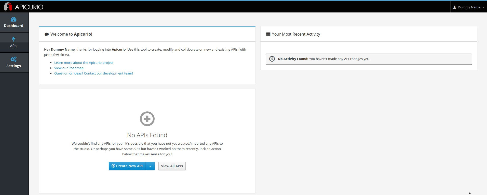

. You also need to open the following URLs in the same browser window (in different tabs) and accept the HTTPS certificate exception.
+
* https://apicurio-studio-ws.$OCP_DOMAIN
* https://apicurio-studio-api.$OCP_DOMAIN

Congratulations, your Apicurio application is set up correctly. Please keep this window open for use later in the lab.

=== Fuse Ignite

Fuse Ignite is part of the Red Hat Fuse 7 release, and is targetted towards citizen developers. Ignite provides a web browser interface that lets you integrate two or more different applications or services without writing code. 

An instance of Fuse Ignite has been deployed for your use. You will find a project called *userX-fuse-ignite* wherein your Fuse Ignite is deployed.

. In a browser, open the URL to Fuse Ignite: http://$OCP_USERNAME-fuse-ignite.apps.$OCP_DOMAIN

. You will be redirected to the Openshift login page.
+

. On successful login, you need to Authorize Access to your profile for SSO. Click on *Allow Selected Permissions*.

. You should now be redirected to the Fuse Ignite home page.
+
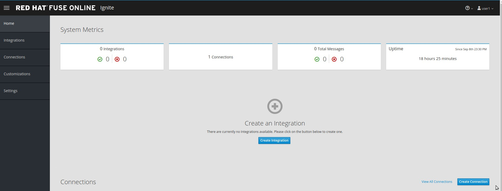

Congratulations, your Fuse Ignite is set up correctly. Please keep this window open for use later in the lab.

=== Red Hat Single Sign On

You have been provided with an ephemeral instance of Red Hat Single Sign On (RH SSO) in order to enable you to use Open ID Connect (OIDC) integration with 3scale API Platform.

The RH SSO is deployed in the namespace *userX-sso*. 

. In a browser, open the secure URL to RH SSO: https://$OCP_USERNAME-sso.apps.$OCP_DOMAIN
. Click on *Administration console*.
. Login with userid *admin* and password *password*.
. You should see the default realm *3scaleRealm* configured.
. Navigate to *Login* tab and select *none* for *Require SSL*. Click on *save*.
+
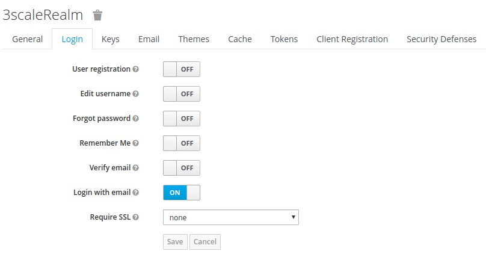

. Repeat the above step for the *Master* realm.

Congratulations, your RH SSO is set up correctly.  Please keep this window open for use later in the lab.

=== Red Hat 3scale

A Red Hat 3scale API Platform multitenant deployment exists in the lab OCP cluster. A tenant for your use has been created. The admin portal for your tenant is accessible at the URL: https://$OCP_USERNAME-3scale-mt-admin.apps.$OCP_DOMAIN

. In a browser, navigate to the admin portal URL.
. Accept the certificate exception.
. Login with your OCP_USERNAME and OCP_PASSWD.
. You should be redirected to the 3scale admin dashboard:
+
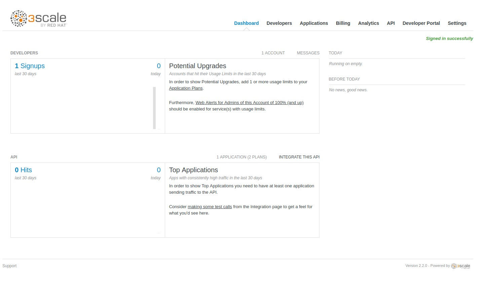

Congratulations, your 3scale API Management Platform is set up correctly.  Please keep this window open for use later in the lab.

=== Red Hat 3scale API Gateway

You have been provisioned with a set of APIcast gateways in the project userX-gw. Here, you will have 2 gateways deployed: *stage-apicast* and *prod-apicast*.

Both the gateways have been configured to communicate with the backend URL for your 3scale tenant.

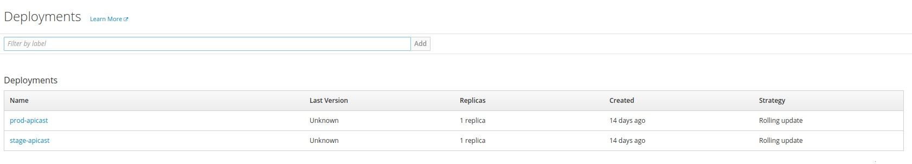

A route for each gateway is set up. The routes for Staging & Production are https://${OCP_USERNAME}-quote-stage.apps.${REGION}.${OCP_DOMAIN} and https://$OCP_USERNAME-quote-prod.apps.$OCP_DOMAIN respectively.

Notice that both the pods are running.

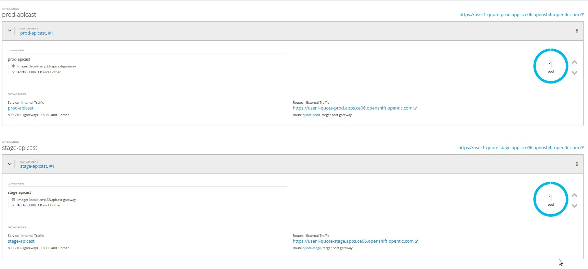

You also need to open the following URLs in the same browser window (in different tabs) and accept the HTTPS certificate exception.
+
* https://$OCP_USERNAME-quote-stage.$OCP_DOMAIN
* https://$OCP_USERNAME-quote-prod.$OCP_DOMAIN

Congratulations, your 3scale API Gateway is set up correctly. Please note your staging & production URLs as you will need it later in the labs.

== Congratulations!

In this lab you successfully completed the intial set up. You have verified that all the required applications are setup and working correctly for your account. You are now ready to work on the business use case of the lab.

IMPORTANT: If you are unable to access any of the above applications, please consult your instructor. Please do not try to proceed with the labs until all the applications are set up correctly.

Proceed to the next lab.

