:noaudio:
:scrollbar:
:data-uri:
:toc2:
:linkattrs:

== Introduction

In this lab, you will be introduced to the 2 backend APIs, and will seed some sample data to be used for the labs.

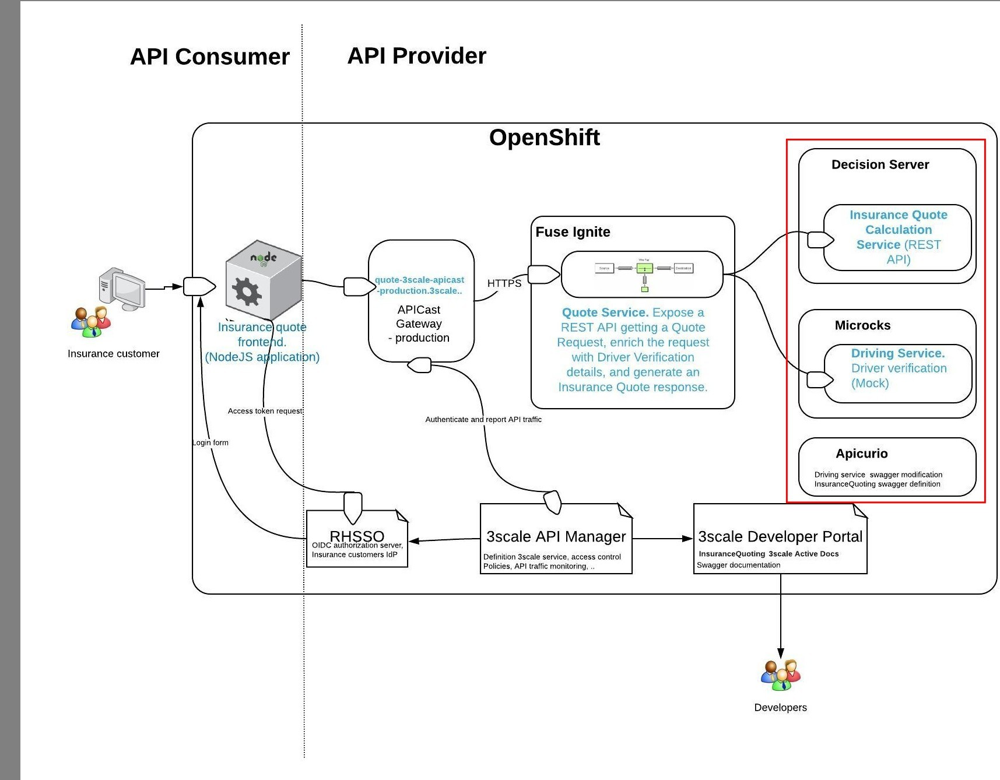

.Goals

* Access the Mock *Driver Service* on Microcks
* Seed and test access to sample data for the mock *Driver Service*
* Update the *Driver Service* API specification in *Apicurio Studio* 
* Download the *Swagger* definition of the *Driver Service* API
* Access the backend *Insurance Quote Calculation* API on Red Hat Decision Manager
* Verify API access to the *Insurance Quote Calculation* API.

== Mock _Driver Service_

=== Introduction

A mock service for verifying Driver details is running on Microcks. There is a single instance of Microcks, so this is a common service for all the users in the lab. 

=== Verify Mock Service

. Open the browser tab where you logged in to *Microcks*.
. Verify that you have access to the *Driver Service* API
+
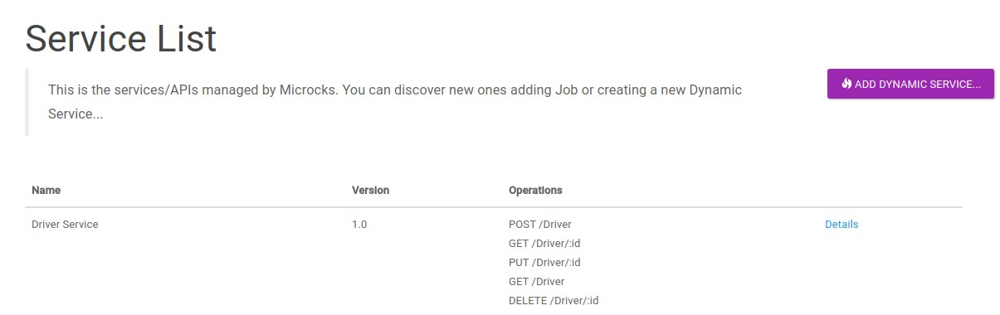

. Click on *Details*.
. You will see the list of supported operations for the API.
+ 
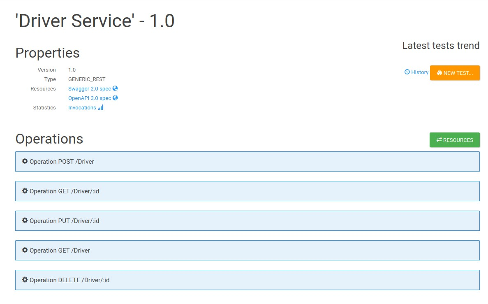

. Click on the **Resources** button. You should see a few mock resources previously created.
+
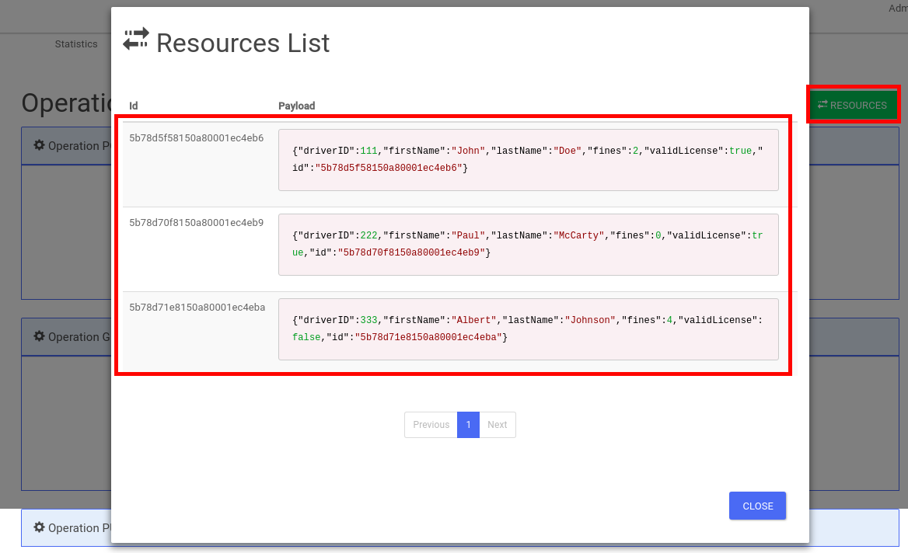

. In a terminal window, you can execute the following *curl* command to add your resources:
+
----
curl -X POST \
  http://microcks.$OCP_SUFFIX/dynarest/Driver%20Service/1.0/Driver/ \
  -H 'content-type: application/json' \
  -d '{"driverID": 100, "firstName": "Jack", "lastName": "Ryan", "fines": 3, "validLicense": true}'

----

. Go back to the Microcks console and check that your resources are added.
+
NOTE: As this is a shared environment, you will notice that resources created by all users are showing up in the list. Provide unique name, driverId & details for your resource.

. Note the *id* of the resource created. Copy the id to a text editor for use later in the lab.
+
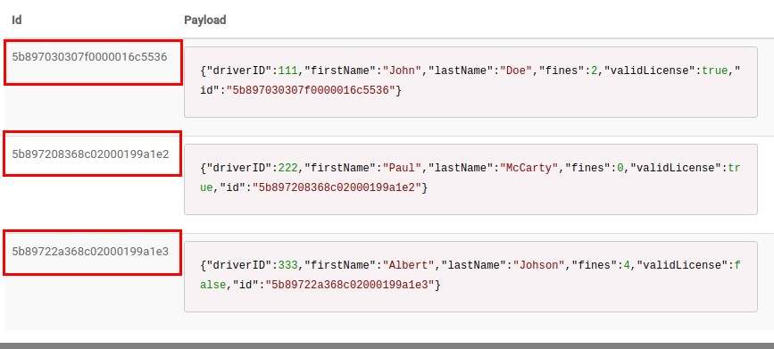

. Close the *Resources* window.
. In a terminal window, you can execute a *curl* command to GET your resource:
+
----
$ curl http://microcks.$OCP_SUFFIX/dynarest/Driver%20Service/1.0/Driver/:id
{ "driverID" : 333, "firstName" : "Albert", "lastName" : "Johson", "fines" : 4, "validLicense" : false, "id" : "5b89722a368c02000199a1e3" }
----
+
NOTE: Replace *:id* above with the ID of the resource you have created.

. Right-click on the *Swagger 2.0 spec* link, click on *copy link address* and paste it in a text editor (you will need it later).

Congratulations, your Mock service is running correctly.

=== Update Driver Service Swagger Spec

IMPORTANT: The APICURIO studio requires a Web Socket connection to the service, which is NOT WORKING in the event Wifi. Hence, please skip the below lab and proceed to the next section. 

. Open the browser tab where you logged in to *Apicurio Studio*.
. Click on the** Import API** button.  
. Enter the URL copied in the previous step.

. Click on the *Import API* button.
+
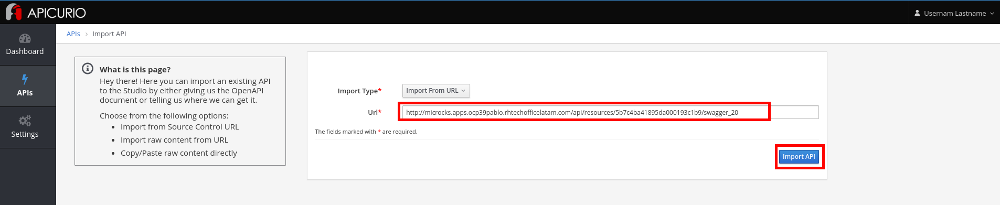

. Click on the *Edit API* button.
+
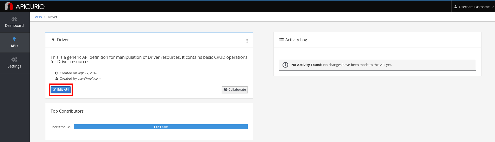

* Click on the **Add** button in the **Definitions **section**.**

* Enter **Driver** and click on the **Add** button.
+
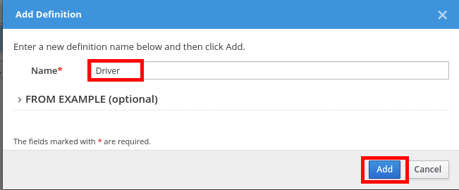

* Add the following properties:
+
.Property
[options="header"]
|=======================
| Property name | Type 
| driverID | String 
| firstName | String 
| lastName | String 
| fines | Integer 
| validLicense | Boolean 
|=======================
+
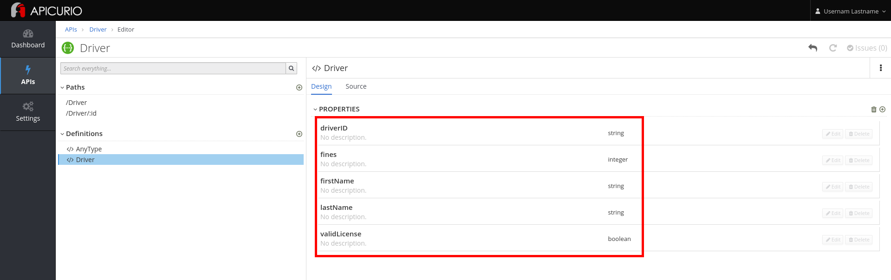

* Click on the **/Driver/:id** path.
* Click on the **GET** operation.
+
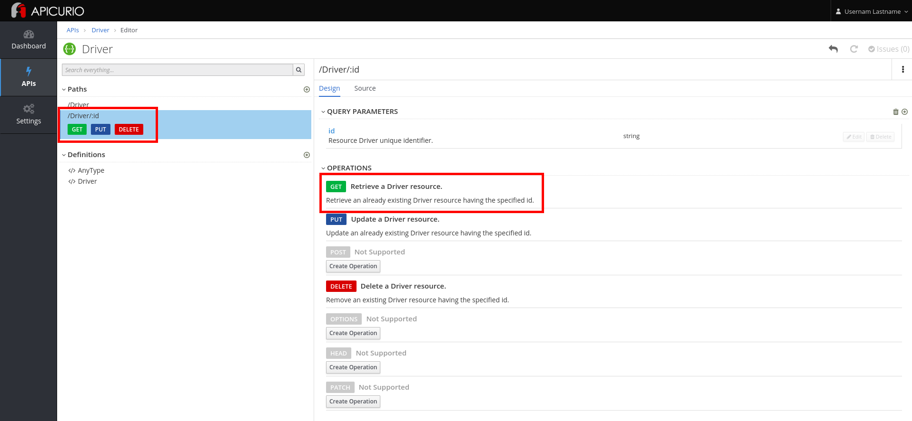

* Click on the **Edit** button next to the **200 OK** Response, in the **Responses **section.
+
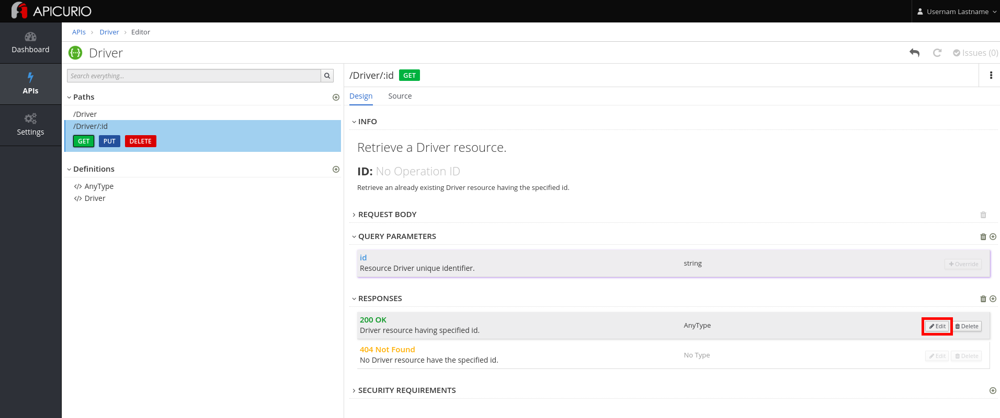

* Select **Driver** as the **Type.**

* Click on the *OK* button.
+
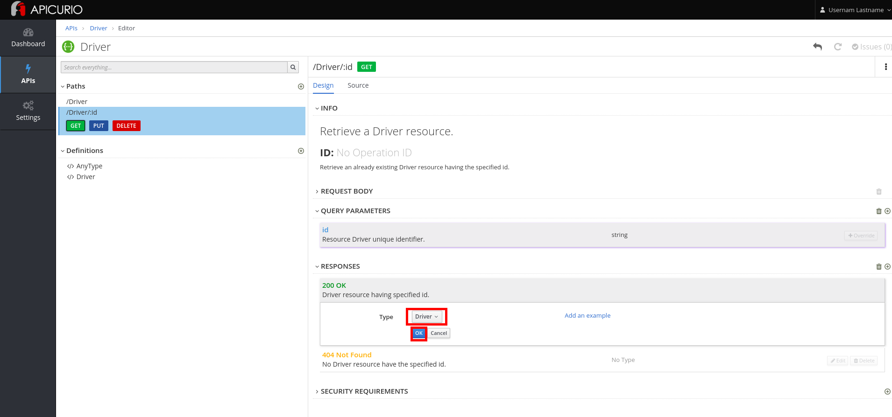

* Click on *Driver* in the breadcrumb.

* Click on the three dots in the **Driver **API, and select *Download (JSON)*.
+
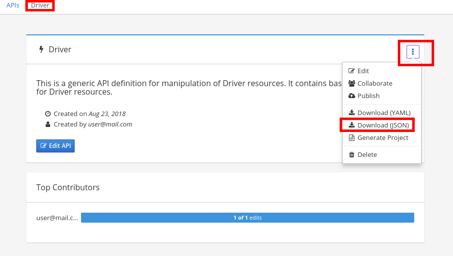

* Save the file to your disk.

== _Insurance Quote Calculation_ Service

=== Introduction

. The *Insurance Quote Calculation* service is a single instance running in the *rhdm* namespace. The key connection parameters for the service are:
+
.Parameters:
[options="header"]
|=======================
  | Parameter | Value | Remarks
  | APPLICATION_NAME | quoting | Name of the rules app.
  | KIE_ADMIN_USER  | admin | Admin user of KIE server
  | KIE_ADMIN_PWD  | password | Admin Password of KIE server  
  | KIE_SERVER_USER  | user | Execution user of KIE server
  | KIE_SERVER_PWD  | password | Execution user's Password of KIE server 
  | KIE_SERVER_CONTAINER_DEPLOYMENT  | quoting=com.redhat:insuranceQuoting:1.0.1 | KIE Server Container deployment configuration
  | SOURCE_REPOSITORY_URL | https://github.com/gpe-mw-training/rhte-api-as-business-labs | Source git repository
  | SOURCE_REPOSITORY_REF | master | git repo branch
  | CONTEXT_DIR | services/InsuranceQuoting | Source code folder in git repo
|=======================
+
NOTE: The Route for accessing the Rules API is http://quoting-kieserver-rhdm.$OCP_SUFFIX

=== Access the *Insurance Quote Calculation* Service

. You can view the Swagger API of the Rules engine by accessing the URL: http://quoting-kieserver-rhdm.$OCP_SUFFIX/docs/

. The Swagger specification for the *Insurance Quote Calculation* Service is here: https://raw.githubusercontent.com/gpe-mw-training/rhte-api-as-business-labs/master/services/RHDM-InsuranceQuoting.json

. Import the Swagger specification above to Apicurio Studio and click on *edit*.
+
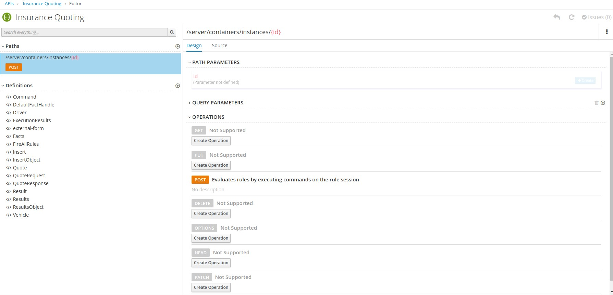

. Note the operation, method, path parameters & object definitions. You will be building the request in the next section to access this API through the Syndesis camel route.

Congratulations, your backend services are now working. Please proceed to the next lab.

