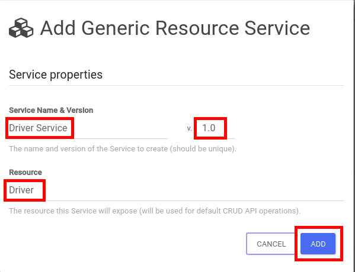

## Create the Traffic Violations Mock API

* Go to [http://microks.REPLACE\_SUFFIX].
* Login as: **user/password**
* Click on the **Services **tab.
* Click on the **Add Dynamic Service **button.
+
image::images/microcks-new-service.png[]

* Enter the following values:
+
.Parameters
[options="header"]
|=======================
| Parameter | Value 
| Service Name | Driver Service 
| Version | 1.0 
| Resource | Driver 
|=======================

* Click on the **ADD **button.
+

* After ~1min a new **Driver Service** should appear in the **Service List.**
* Open a terminal and execute the following commands:
+
-----
curl -X POST \
  http://microcks.REPLACE_SUFFIX/dynarest/Driver%20Service/1.0/Driver/ \
  -H 'content-type: application/json' \
  -d '{"driverID": 111, "firstName": "John", "lastName": "Doe", "fines": 2, "validLicense": true}'

curl -X POST \
  http://microcks.REPLACE_SUFFIX/dynarest/Driver%20Service/1.0/Driver/ \
  -H 'content-type: application/json' \
  -d '{"driverID": 222, "firstName": "Paul", "lastName": "McCarty", "fines": 0, "validLicense": true}'

curl -X POST \
http://microcks.REPLACE_SUFFIX/dynarest/Driver%20Service/1.0/Driver/ \
-H 'content-type: application/json' \
-d '{"driverID": 333, "firstName": "Albert", "lastName": "Johson", "fines": 4, "validLicense": false}'
-----

* Close the terminal and go back to the **Microcks **console.
* Click on the **Resources** button.
* You should see the three created **Driver** resources.
+
image::images/microcks-resources.png[]

* Close the window.
* Right-click on the **Swagger 2.0 spec** link, click on "**copy link address"** and paste it in a text editor \(you will need it later\).

