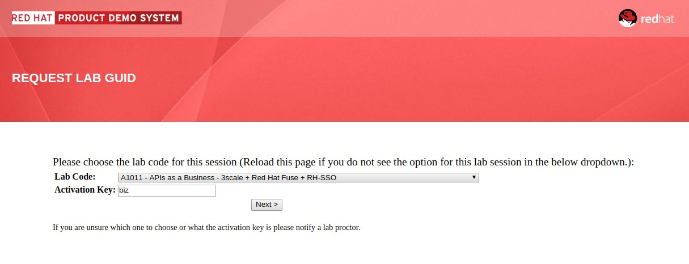

:noaudio:
:scrollbar:
:data-uri:
:toc2:
:linkattrs:

= Lab Setup

.Prerequisites
.. `ssh` utility installed on your laptop
.. Web browser installed on your laptop
.. broadband internet connectivity

:numbered:

== Overview

This first lab orients you with the course lab assets provided to you.

Your lab environment consists of the following:

. *Remote Virtual Machine*
+
Accessible via the ssh protocol.
This is a client VM with the *oc* client and required tools pre-installed. You can use this remote VM to run the commands shown in the labs.

. *OpenShift Master*
+
Accessible via browser or *oc* command utility.
This is the OpenShift Platform where the lab assets will be deployed.

== Access Course VM via `GUID Grabber`

This section of the lab explains how to access the Red Hat Tech Exchange _GuidGrabber_ in order to obtain a GUID.
This GUID will be used to access the lab environment.

. Begin by going to http://bit.ly/rhte-guidgrabber
+

. From this page select the *Lab Code* :  _A1011_

. Enter the *Activation Key* provided by the lab instructor.

. Click *Next*.

. The resulting page will display your lab's GUID and other useful information about your lab environment.
+
image::images/guidgrabber_response.png[Guid Grabber Information Page]

. Your remote virtual machine is accessible via the `ssh` protocol.
+
Follow the directions exactly as indicated in the Guid Grabber Information Page to ssh into your remote lab VM.

. When you are completely done with your lab environment at the end of this course, please click *Reset Workstation* so that you can move on to the next lab.
If you fail to do this, you will be locked into the GUID from the previous lab.
+
[NOTE]
Clicking *Reset Workstation* will not stop or delete the lab environment.

== Environment Variables

Once you've ssh'd into your remote terminal window, you'll want to set the following environment variables:

-----
#  Using the above variables, copy & paste the following in the same terminal #

echo "export LAB_CODE=a1011" >> ~/.bashrc
echo "export OCP_USERNAME=userX" >> ~/.bashrc
echo "export OCP_PASSWD=r3dh4t1\!" >> ~/.bashrc
echo "export OCP_REGION=`echo $HOSTNAME | cut -d'.' -f2`" >> ~/.bashrc
echo "export OCP_DOMAIN=\$OCP_REGION.rhte.opentlc.com" >> ~/.bashrc

source ~/.bashrc

-----

NOTE: Your userid will have the same number as your assigned lab number. For instance, if your lab number is 24, your userid is *user24* to login to OCP.

== OpenShift Container Platform

Your lab environment is built on Red Hat's OpenShift Container Platform.

Access to your OCP resources can be gained via both the `oc` utility as well as the OCP web console.

. Using the `oc` utility, log into OpenShift
+
-----
oc login https://master.$DOMAIN:443 -u $OCP_USERNAME -p $OCP_PASSWD
-----

. Ensure that your `oc` client is the same minor release version as the server:
+
-----
oc version
-----

* You should see:
+
-----
oc v3.9.40
kubernetes v1.9.1+a0ce1bc657
features: Basic-Auth GSSAPI Kerberos SPNEGO

Server https://master.f72e.rhte.opentlc.com:443
openshift v3.9.40
kubernetes v1.9.1+a0ce1bc657

-----

.. In the above example, notice that version of the `oc` client is of the same release as the remote OCP master API.
.. There a known subtle problems with using a version of the `oc` client that is different from your target OpenShift server.

== View OpenShift Web Console

. Log into OpenShift Web Console
.. Many OpenShift related tasks found in this lab can be completed in the Web Console (as an alternative to using the `oc` utility).
.. To access the OCP web console, point your browser to the output of the following:
+
-----
echo -en "\n\nhttps://master.$OCP_DOMAIN:443\n\n"
-----
+
NOTE: If your web browser prompts about `connection privacy / security`, select `Advanced` and continue.
+
.. Authenticate using the values of `userX` and `r3dh4t1!`
+
NOTE: Replace userX with your actual userid.

== Congratulations!

In this lab you successfully completed the intial set up.

Proceed to the next labs.

