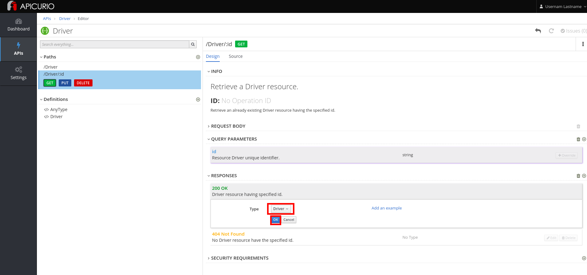

* Go to http://apicurio.REPLACE\_SUFFIX
* Click on the **Register** link.
+
image::images/apicurio-register.png[]

* Complete the form with the following values:  
+
.Parameters
[options="header"]
|=======================
  | Parameter | Value 
  | **First Name** | Username 
  | **Last Name** | Lastname 
  | **Email** | [user@mail.com](mailto:user@mail.com) 
  | **Password** | password 
  | **Confirm Password** | password 
|=======================

* Click on the **Register **button.
+
image::images/apicurio-register2.png[]

* Click on the** Import API** button.  

* Enter the URL copied in the previous step.

* Click on the **Import API** button.
+
image::images/apicurio-importAPI.png[]

* Click on the **Edit API** button.
+
image::images/apicurio-editAPI.png[]

* Click on the **Add** button in the **Definitions **section**.**

* Enter **Driver** and click on the **Add** button.
+
image::images/apicurio-addDefinition.png[]

* Add the following properties:
+
.Property
[options="header"]
|=======================
| Property name | Type 
| driverID | String 
| firstName | String 
| lastName | String 
| fines | Integer 
| validLicense | Boolean 
|=======================
+
image::images/apicurio-DriverProps.png[]

* Click on the **/Driver/:id** path.
* Click on the **GET** operation.
+
image::images/apicurio-DriverGetOP.png[]

* Click on the **Edit** button next to the **200 OK** Response, in the **Responses **section.
+
image::images/apicurio-EditResponse.png[]

* Select **Driver** as the **Type.**

* Click on the **OK** button.
+

* Click on **Driver** in the breadcrumb.

* Click on the three dots in the **Driver **API, and select **Download \(JSON\)**.
+
image::images/apicurio-SaveJSON.png[]

* Save the file to your disk.

