:noaudio:
:scrollbar:
:data-uri:
:toc2:
:linkattrs:

== Introduction

In this lab, you will create the Integration flow to orchestrate the 2 backend services, and expose a composite REST QuoteAPI service.

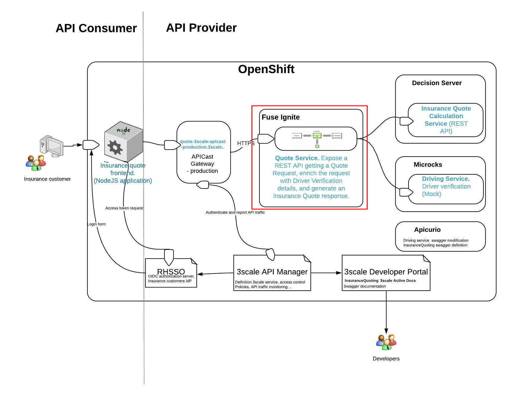

.Goals
* Import the integration to Syndesis.
* Import Syndesis extensions.
* Configure API connectors
* Deploy the Syndesis Integration
* Test the QuoteAPI Service

== Import the Syndesis Integration

An integration export schema is provided in the lab assets to help you get started with the integration. Follow the below steps to import the integration:

. Open the Fuse Online (Syndesis) web console on the browser.
. Click on *Integrations*.
. Click on *Import* button.
+
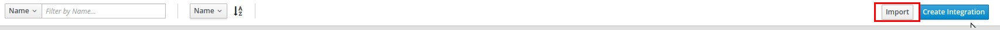

. Click on *Choose File* and choose the *InsuranceQuoting-export.zip* file.
. Check that the integration is imported correctly:
+
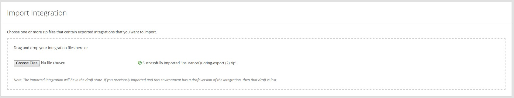

. Click on *Done*.
. You can see the Integration listed in the Integrations home page:
+
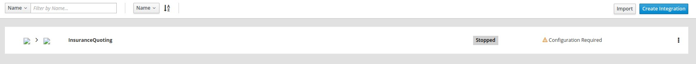
+
NOTE: Note that the Integration has a warning *Configuration Required*. Before the integration can be deployed, the extensions & connections need to be configured.

== Syndesis Configuration - Extensions

There are certain extensions that are required to be installed in Syndesis in order to enable certain features required for the lab. These are:

. *Webhook* - This extension provides a connector that allows to expose a HTTP endpoint in order to receive triggers from external platforms.
. *Datashape* - to specify input and output data shapes in the exchange.
. *SetBodyJS* - to set the body of the exchange using `javadcript`.
. *ManageHeaders* - to set the or remove an header of the exchange.
. *Script* - to add dynamic scripting to Syndesis using either `groovy` or `javascript`.

=== Import Extensions

. Open the Fuse Ignite (Syndesis) web console on the browser.
. Click on *Customizations*.
. Click on the *Extensions* tab.
. Notice that 3 extension definitions are imported as part of the Integration.

. Click on the *Import Extension* button.
+
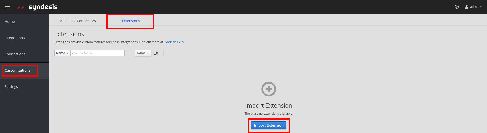

. Select the *fuse-ignite/extensions/syndesis-extension-datashape-1.0.0.jar* file.
. Click on the *Import Extension* button.
+
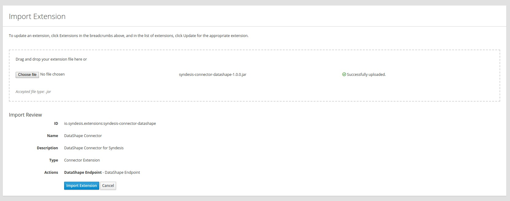

. Repeat these steps for the following extensions:
.. syndesis-connector-webhook-1.0.0.jar

. Now update the following 3 extensions with the downloaded extension jar files:
.. syndesis-connector-datashape-1.0.0.jar
.. syndesis-extension-script-1.0.0.jar
.. syndesis-extension-manage-headers-1.0.0.jar

. You should see all 5 estensions imported successfully.
+
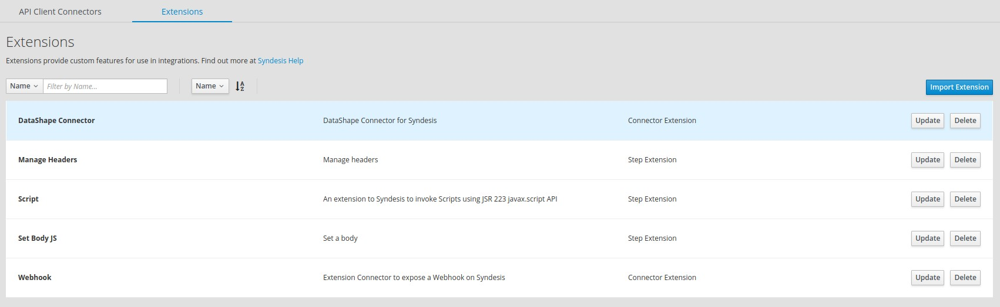

Congratulations, the syndesis extensions are now imported successfully.

== Syndesis Configuration - Connectors

. There would be 2 API connectors imported from the integration.
+
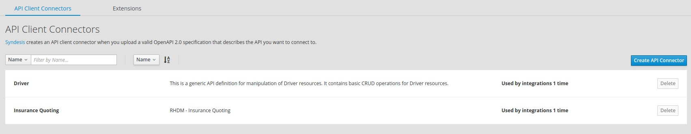

. Click on *Driver* API and ensure the details are as below:
+
.Parameters
[options="header"]
|=======================
| Parameter | Value 
| *Host* | http://microcks.api-lifecycle.svc.cluster.local:8080
| *Base URL* | /dynarest/Driver%20Service/1.0/ 
|=======================
+
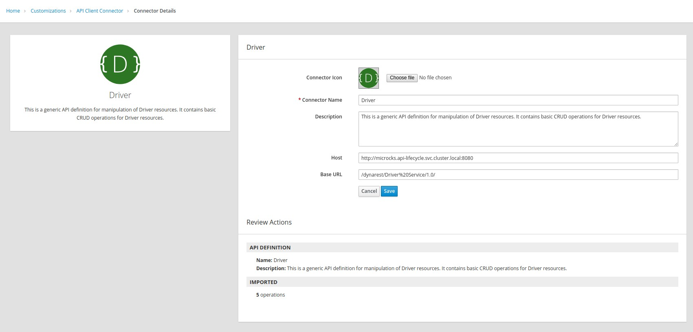

. If any of the details are incorrect, click on *edit* and save the changes.

. Click on the *Insurance Quoting* API, and ensure the details are as provided below:
+
.Parameters
[options="header"]
|=======================
| Parameter | Value 
| *Host* | http://quoting-kieserver.rhdm.svc.cluster.local:8080
| *Base URL* | /services/rest 
|=======================

. If any of the details are incorrect, click on *edit* and save the changes.
+
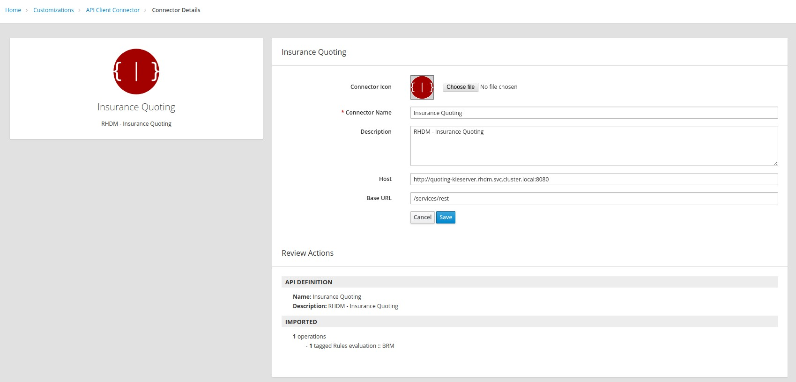

. Now click on *Connections* button and notice the *RHDM-InsuranceQuoting* connection shows a *Configuration Required* warning.
+
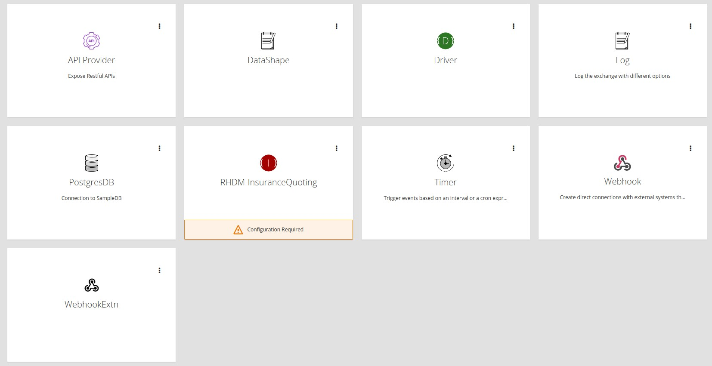

. Click on *RHDM-InsuranceQuoting* connection.
. Click on *Edit*.
. Edit the *Username* to *user*, and *Password* to *password*.
+
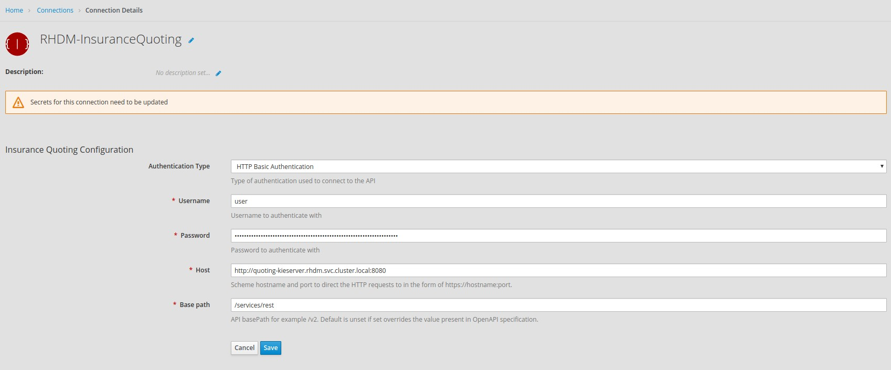

. Click on *Save*.

Congratulations, the API connectors for both backend services are now set up correctly in Syndesis. 

== Syndesis Integration

The Integration on Syndesis consists of the following steps:

* *WebHook Connector* - Starting point of Integration, to expose a HTTP POST endpoint. Will receive a Quote Request JSON object.
* *setBodyJS* - To extract the *id* of the request.
* *Set Header* - To set the header *Connection: close* so that the HTTP connection to Driver API is closed.
* *Driver API* - External request to Driver Service mock API to get the Driver validation details.
* *DataMapper* - To map the response message to the Request for the Insurance Quote Calculation Service.
* *Script* - To set the required HTTP headers and JSON object for the Insurance Quote calculation Service.
* *RHDMInsuranceQuoting* - External request to Insurance Quote Calculation service to get the price quote for the driver.
* *DataMapper* - To map the response message to the Quote response object.
* *DataShape Connector* - Finish connector, for returning the Quote Response JSON object data shape. 

The Integration design is as below:

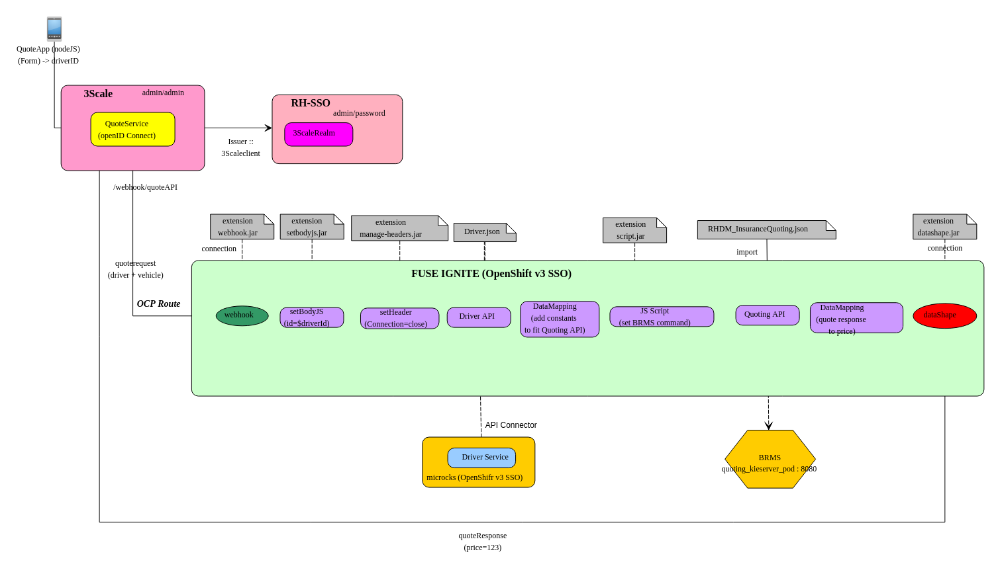

. Click on the *Integration* link, and select *InsuranceQuoting* integration.
+
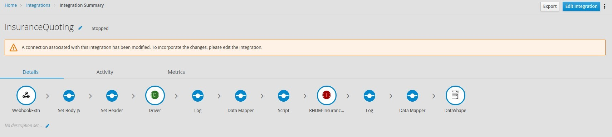

. Click on *Edit Integration* button.

. You should be able to see the steps in the Integration. You can click on the individual steps and inspect the integration.

. Click on the *Publish* button.

. Wait for the integration to be deployed (~5min).

. In the terminal where you logged in to OCP, execute the following commands:
+
-----
oc project $OCP_USERNAME-fuse-ignite
oc expose dc i-insurancequoting --port 8080
oc expose service i-insurancequoting
-----

. Find out the route exposed for your integration:
+
----
oc get route | grep insurancequoting

----
+
NOTE: The route will be of the format: http://i-insurancequoting-$OCP_USERNAME-fuse-ignite.$OCP_SUFFIX

=== Test the Integration Route

. You can test if your integration route is working correctly 
. Send a curl request as below:
+
----
 curl -X POST --header 'Content-Type: application/json' --header 'Accept: application/json' -d '{"driver": {"age":20, "firstName": "Pablo", "lastName": "Szuster", "validLicense": true, "driverID": 12345, "id": "5b89722a368c02000199a1e3", "fines":0},  "vehicle": {"maker": "Chevrolet", "model": "Cruze","modelYear": 2017, "mileage": 5000,"licensePlate": "ABC123"}  }' 'http://i-insurancequoting-$OCP_USERNAME-fuse-ignite.$OCP_SUFFIX/webhook/QuoteAPI'

----
+
NOTE: Provide a valid *id* of the resource that you have created for your Mock *Driver Service*.

. If your integration route is working correctly, you should see a response as below:
+
----
{"price": 1100}
----

. You can see the log of your route and any errors in the Syndesis Integration Page. Click on the *Activity* tab.
+
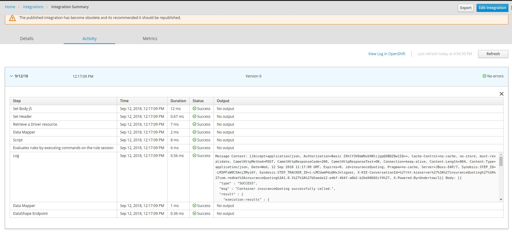

IMPORTANT: If the integration reports any errors, fix it and retest. 

== Bonus: Integration Instructions

=== Create the Integration

 . Click on the *Integrations* tab.
. Click on the *Create Integration* button.
. Select *Webhook* as the *Start Connection*.
+
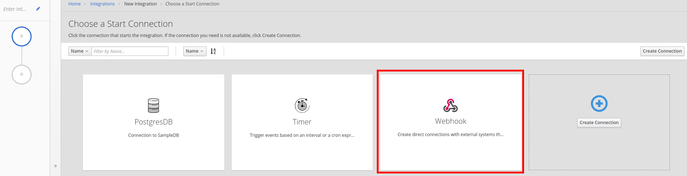

 . Select the only available action.
 . Change the *Webhook Token* to *QuoteAPI*.
 . Click on the *Next button.*
+
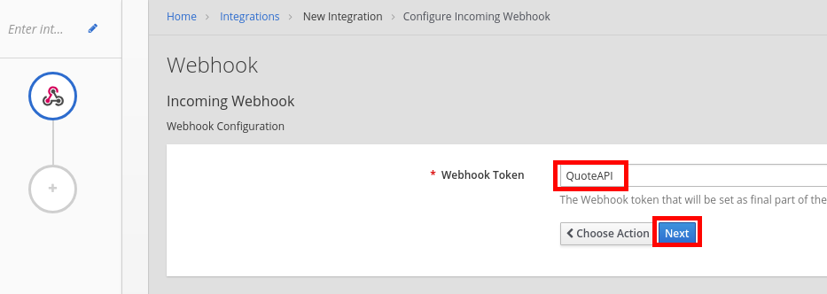

 . Select *JSON Instance* as *Type.*
 . Paste the contents of the *Labs\quoteRequest.json* file into the *Definition* field.
 . Enter *QuoteRequest* as *Data Type Name*.
 . Click on the *Done* button.
+
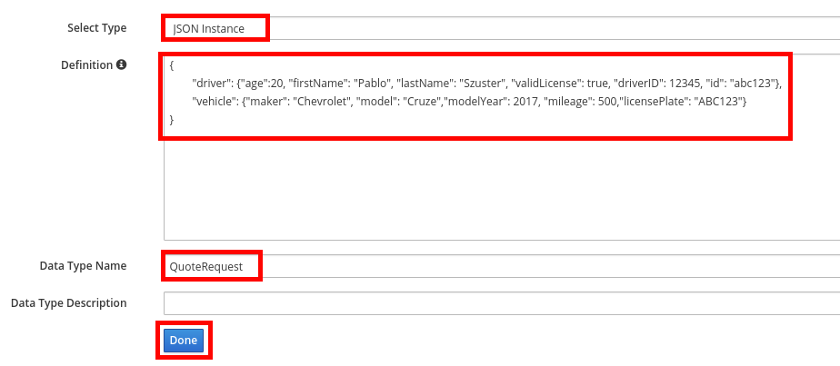

 . Select *DataShape* as the *Finish* *Connection*.
 . Select the only available action.
 . Select *JSON Instance* as *Type.*
 . Enter the following in the *Definition* field:
+
-----
{ "price": 123 }
-----

 . Enter *QuoteResponse* as *Data Type Name*.

 . Hover over the *plus* sign and click on *Add a Step*.
. Select *Set Body JS.*
. Enter the following as *Body:*
+
-----
'{"parameters":{"id": "' + JSON.parse(exchange.in.getBody(java.lang.String.class)).driver.id + '"}}'
-----

 . Click on the *Done* button.
+
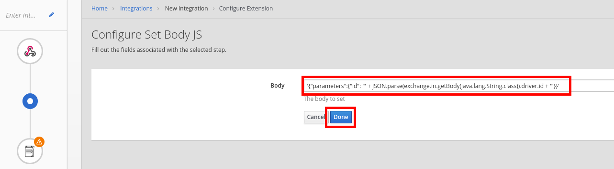

 . Click on the *Add a step* after the *Set Body JS* step.
. Select *Set Header*.
. Add the following values:
.. *Header name:* Connection
.. *Header value:* close
+
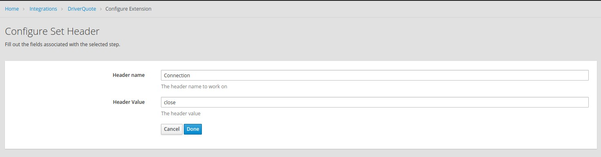

 . Click on *Add a connection*.
. Select *Driver API*.
. Select *Retrieve a Driver resource.*
+
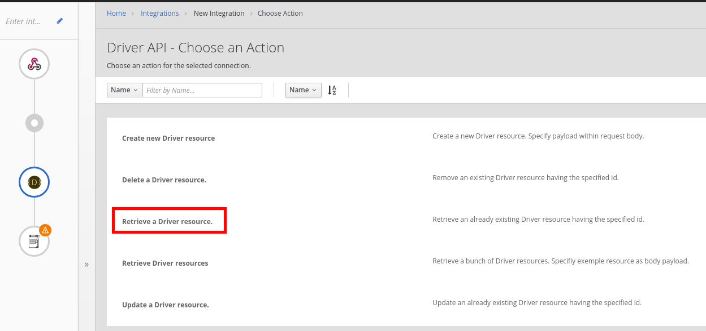

 . Add a connection after *Driver API*.
 . Select *RHDM-InsuranceQuoting.*
 . Select the only available action.
 . Click on orange circle with a warning icon inside on the top of the *RHDM-InsuranceQuoting* connection.
 . Click on the *Add a data mapping step* link.
+
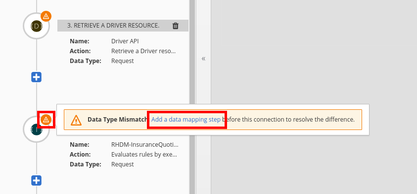

 . Create the following constants:
+
.Constants
[options="header"]
|=======================
| Value | Type 
| quoting | String 
| quote1 | String 
| 0 | Integer 
| true | Boolean 
| ksession | String 
|=======================

 . Perform the following mappings:
+
.Mappings
[options="header"]
|=======================
| Source | Target 
| Contants -&gt; quoting | parameters -&gt; id 
| Contants -&gt; ksession | body -&gt; lookup 
| Contants -&gt; quote1 | body -&gt; commands -&gt; insert -&gt; out-identifier 
| Contants -&gt; true | body -&gt; commands -&gt; insert -&gt; return-object 
| Contants -&gt; 0 | body -&gt; commands -&gt; insert -&gt; object -&gt; com.redhat.insurancequoting.Quote -&gt; price     
|=======================

 . It should look like this:
+
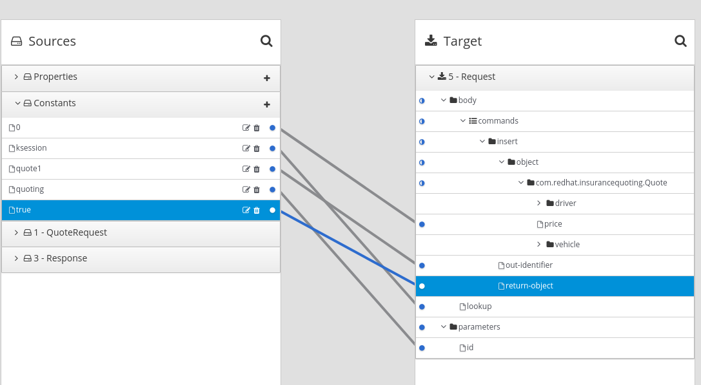

 . Perform the following mappings:
+
.Mappings
[options="header"]
|=======================
| Source | Target 
| QuoteRequest -&gt; driver -&gt; age | body -&gt; commands -&gt; insert -&gt; object -&gt; com.redhat.insurancequoting.Quote -&gt; driver -&gt; age 
| QuoteRequest -&gt; driver -&gt; firstName | body -&gt; commands -&gt; insert -&gt; object -&gt; com.redhat.insurancequoting.Quote -&gt; driver -&gt; firstName 
| QuoteRequest -&gt; driver -&gt; lastName | body -&gt; commands -&gt; insert -&gt; object -&gt; com.redhat.insurancequoting.Quote -&gt; driver -&gt; lastName 
| QuoteRequest -&gt; driver -&gt; validLicense | body -&gt; commands -&gt; insert -&gt; object -&gt; com.redhat.insurancequoting.Quote -&gt; driver -&gt; validLicense 
| QuoteRequest -&gt; vehicle -&gt; licensePlate | body -&gt; commands -&gt; insert -&gt; object -&gt; com.redhat.insurancequoting.Quote -&gt; vehicle -&gt; licensePlate 
| QuoteRequest -&gt; vehicle -&gt; maker | body -&gt; commands -&gt; insert -&gt; object -&gt; com.redhat.insurancequoting.Quote -&gt; vehicle -&gt; maker 
| QuoteRequest -&gt; vehicle -&gt; mileage | body -&gt; commands -&gt; insert -&gt; object -&gt; com.redhat.insurancequoting.Quote -&gt; vehicle -&gt; mileage 
| QuoteRequest -&gt; vehicle -&gt; model | body -&gt; commands -&gt; insert -&gt; object -&gt; com.redhat.insurancequoting.Quote -&gt; vehicle -&gt; model 
| QuoteRequest -&gt; vehicle -&gt; modelYear | body -&gt; commands -&gt; insert -&gt; object -&gt; com.redhat.insurancequoting.Quote -&gt; vehicle -&gt; modelYear 
| Response -&gt; fines | body -&gt; commands -&gt; insert -&gt; object -&gt; com.redhat.insurancequoting.Quote -&gt; driver -&gt; fines 
|=======================

 . Click on the *Done* button.
+
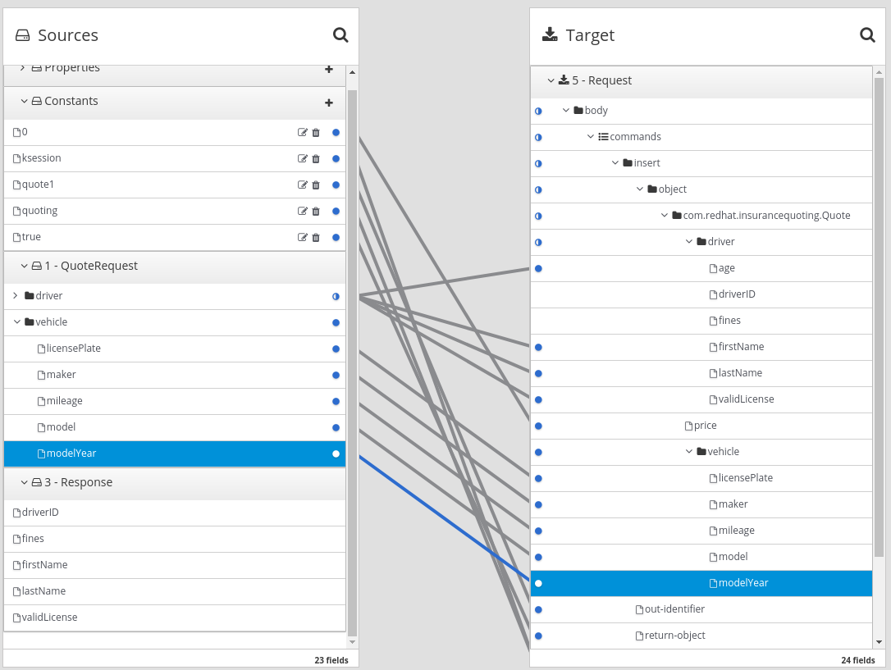

 . Click on orange circle with a warning icon inside on the top of the *DataShape* connection.
 . Click on the *Add a data mapping step* link.
+
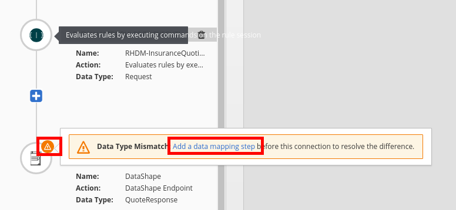

 . Perform the following mapping:  
+
.Mappings
[options="header"]
|=======================
  | Source | Target     
  | Response -&gt; result -&gt; execution-results -&gt; results -&gt; value -&gt; com.redhat.insurancequoting.Quote -&gt; price | QuoteResponse -&gt; price 
|=======================

 . Click on the *Done* button.
+
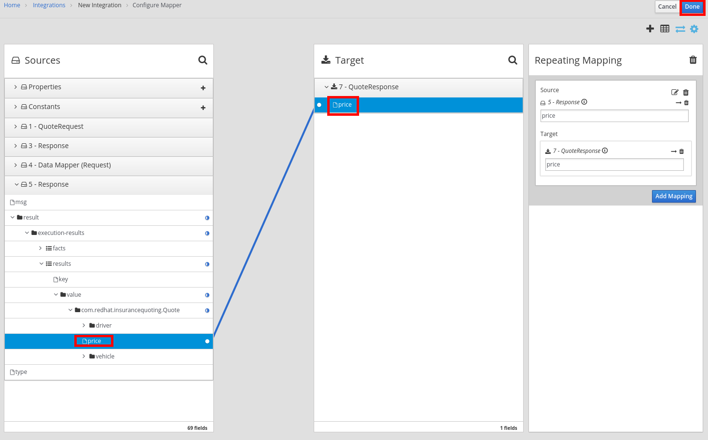

 . Add a step *before* the *RHDM-InsuranceQuoting* connection.
+
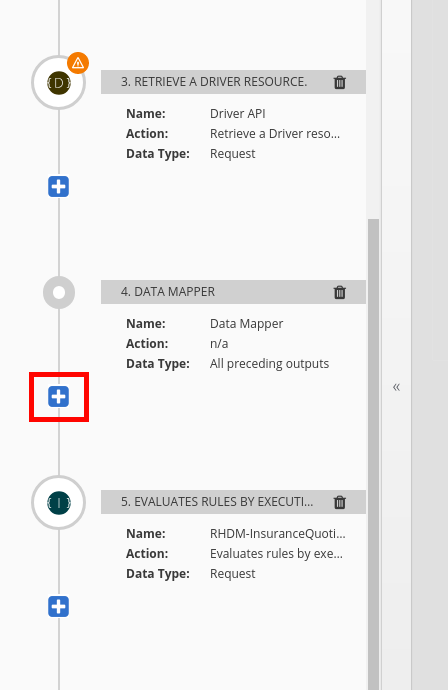

 . Select *Script*.
 . Select *Javascript* as the *Language*.
 . Enter the following code as *Script:*
+
-----
var obj = JSON.parse(body);
var fire = {"fire-all-rules": {}};
obj.body.commands.push(fire);
exchange.out.headers['Content-Type'] = 'application/json';
exchange.out.headers['Accept'] = 'application/json';
exchange.out.body =JSON.stringify(obj);
-----
 . Click on the *Done* button.
 * Your Integration should look like this:
+
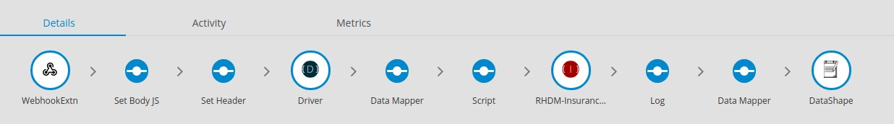

. Click on the *Publish* button.

. Wait for the integration to be deployed (~5min).

. In the terminal where you logged in to OCP, execute the following commands:
+
-----
oc project $OCP_USERNAME-fuse-ignite
oc expose dc i-insurancequoting --port 8080
oc expose service i-insurancequoting
-----

. Find out the route exposed for your integration:
+
----
oc get route | grep insurancequoting

----
+
NOTE: The route will be of the format: http://i-insurancequoting-$OCP_USERNAME-fuse-ignite.$OCP_SUFFIX

Now you can proceed with *Testing the Integration*.

Congratulations, your Integration Quote API is now set up. Proceed to the next lab.

