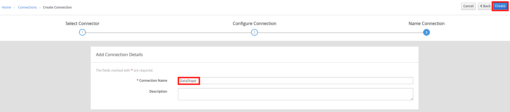

## Import Extensions

* Go to http://syndesis-fuse.REPLACE_SUFFIX
* Login as admin/r3dh4t1!
* Click on the **Customizations** tab.
* click on the **Extensions** tab.
* Click on the **Import Extension** button.
+
image::images/ignite-Extensions.png[]

* Select the **Labs\files\syndesis-extension-setbodyjs-1.0.0.jar **file.
* Click on the **Import Extension **button.
+
image::images/ignite-ImportExtension.png[]

* Repeat these steps for the following extensions:

** syndesis-connector-datashape-1.0.0.jar
** syndesis-extension-script-1.0.0.jar
** syndesis-extension-manage-headers-1.0.0.jar
** syndesis-connector-webhook-1.0.0.jar
+
image::images/ignite-ImportedExtensions.png[]

* Click on the **Connections** tab.

* Click on the **Create Connection** button.

* Select ** DataShape Connector**.
* Enter **DataShape** as **Connection Name**.
* Click on the **Create** button.
+

* Click on the **Create Connection** button.

* Select **Webhook**.
* Enter **Webhook** as **Connection Name**.
* Click on the **Create **button.

