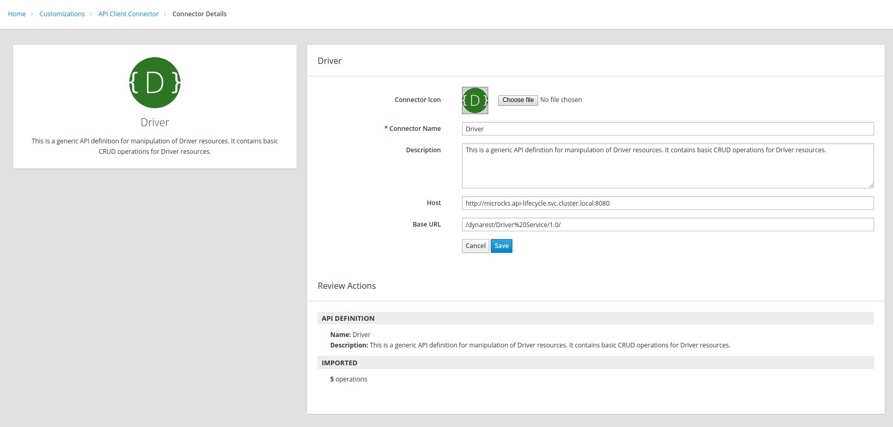
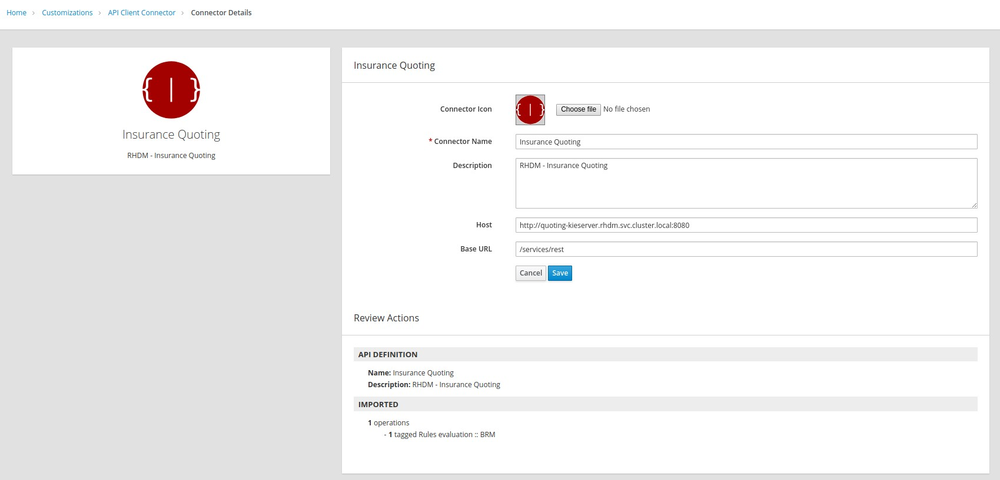

## Create the API Connectors

* Click on the **Customizations** tab.
* Click on the **API Client Connectors** tab.
* Click on the **Create API Connector** button.
+

* Click on the **Choose File** button and browse to the location of the **Driver.json** file.
* Click on the **Next** button.
+

* Click on the **Next **button again.
* Click on the **Next** button again.
* Enter the following values:
+
.Parameters
[options="header"]
|=======================
| Parameter | Value 
| **Host** | http://microcks.microcks.svc.cluster.local:8080
| **Base URL** | /dynarest/Driver/1.0/ 
|=======================

* Click on the **Create API Connector **button.
+

* Click on the **Create API Connector** button again.
* Click on the **Choose File** button and browse to **Labs\RHDM-InsuranceQuoting.json**
* Click on the **Next** button
* Click on the **Next **button again.
* Click on the **Next** button again.

* Enter the following values:
+
.Parameters
[options="header"]
|=======================
| Parameter | Value 
| **Host** | http://quoting-kieserver.rhdm.svc.cluster.local:8080
| **Base URL** | /services/rest 
|=======================

* Click on the **Create API Connector **button.
+

* Click on the **Connections** tab.
* Click on the **Create Connection **button.
* Select **Driver**.
+

* Click on the **Next** button.
* Enter **Driver API** as **Connection Name**.
* Click on the **Create **button.
+

* Click on the **Create Connection **button.
* Select **Insurance Quoting**.
* Enter the following values:
** **Username: ** user
** **Password:** password
* Click on the **Next** button
+

* Enter **RHDM-InsuranceQuoting** as **Connection Name**.
* Click on the **Create Connection** button.

