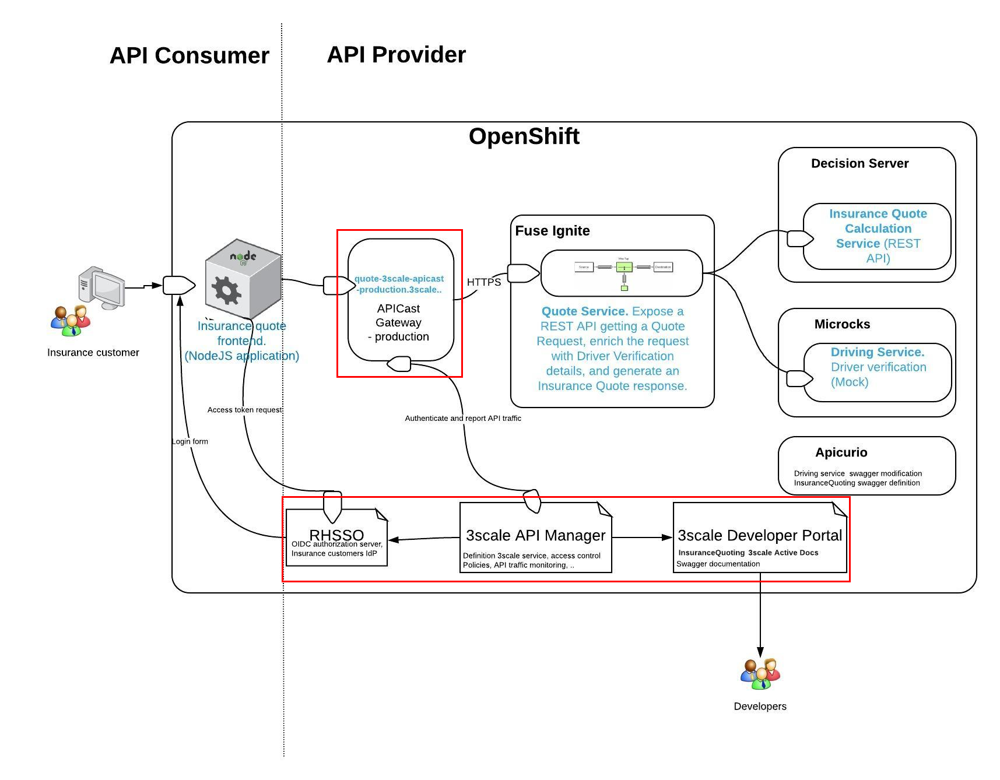
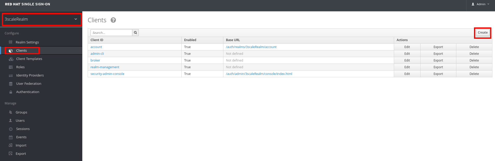
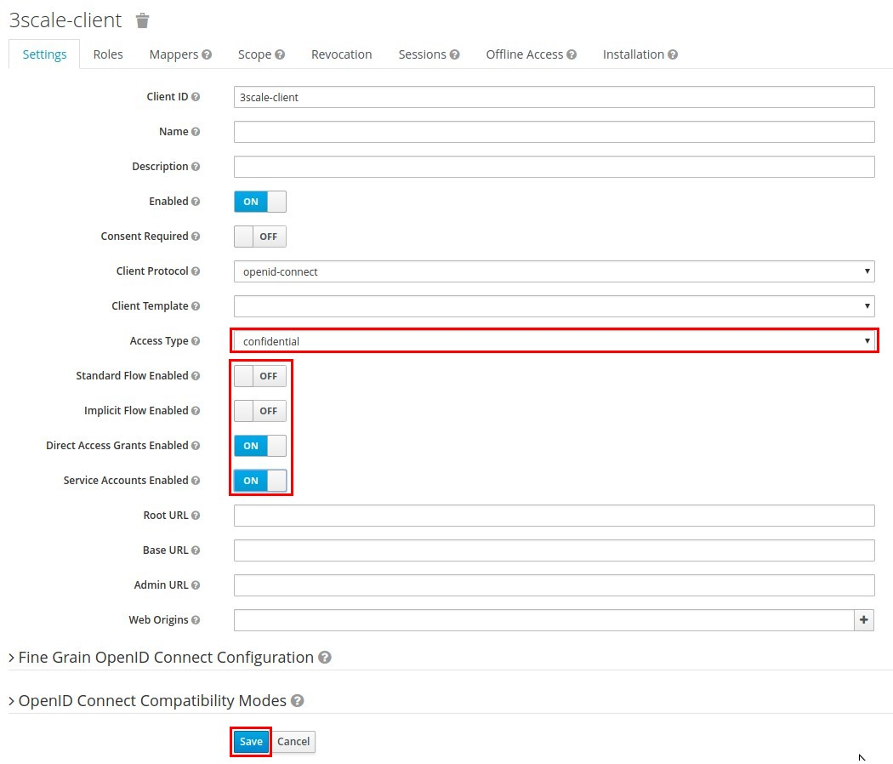
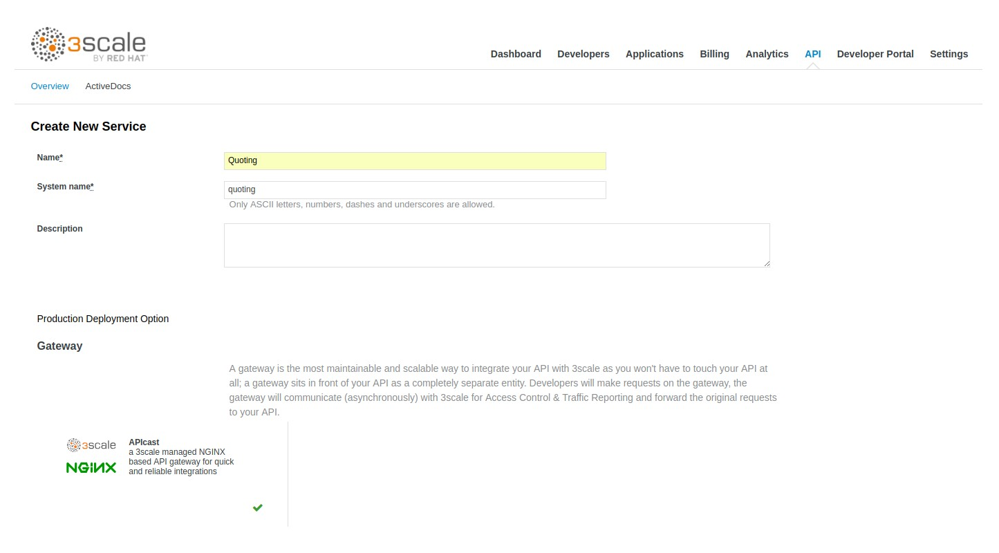
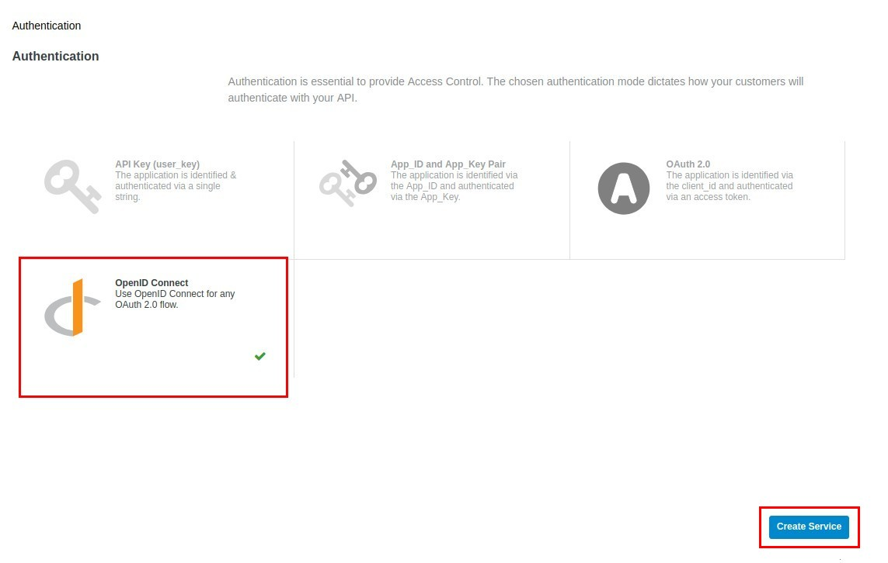
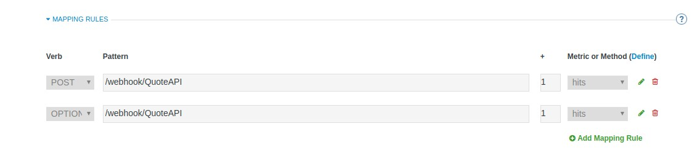
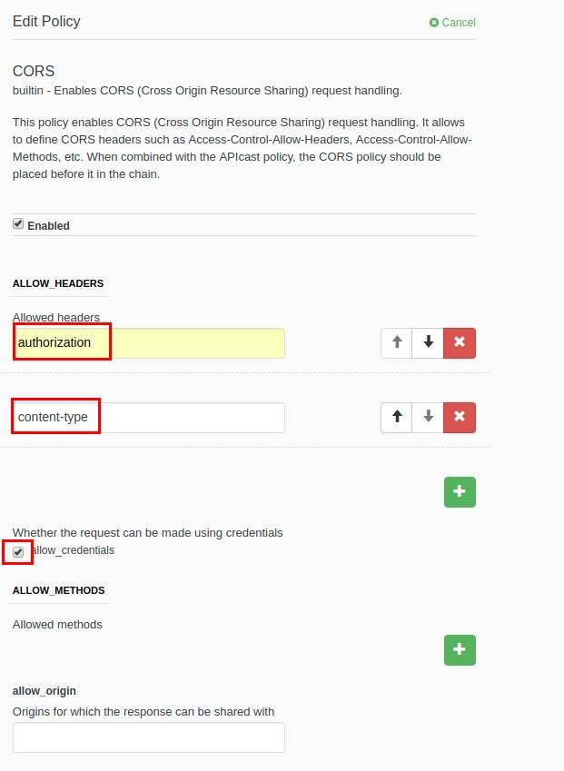
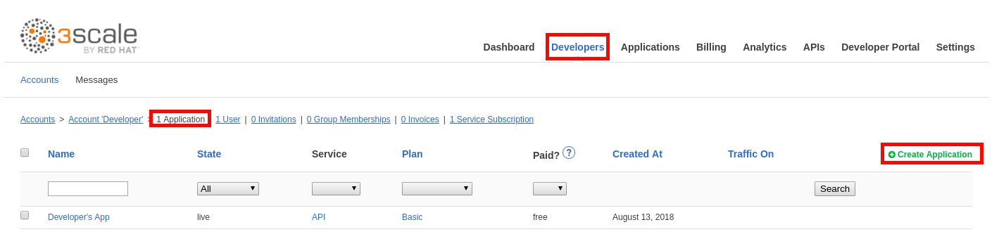
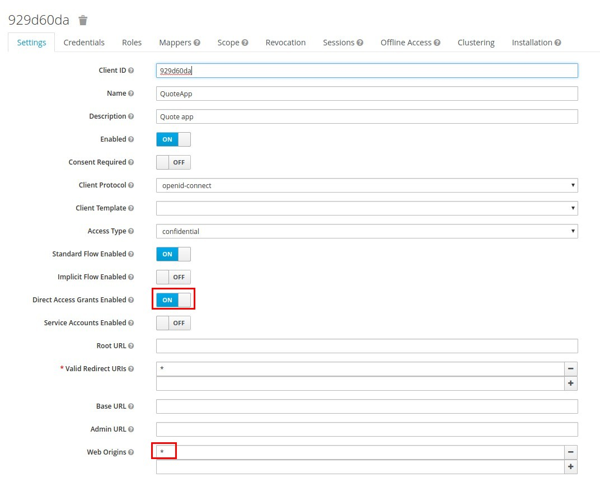

:noaudio:
:scrollbar:
:data-uri:
:toc2:
:linkattrs:

== Introduction

In this lab, you will be setting up the API Management of the Insurance Quote API created in the last lab, and configure Red Hat Single Sign On (RH SSO) realm for providing Open ID Connect (OIDC) authentication of API consumers.

.Goals
* Configure 3scale realm in RH SSO
* Configure Service in 3scale
* Create users & accounts in 3scale

== Configure 3scaleRealm in RH SSO

The 3scaleRealm is a SSO realm configured to be used for user & client management of 3scale. A 3scale-client is configured, to set up communication between 3scale & RH SSO. A sample user *user1* is created, which will be used later in the lab for authenticating the API consumer.

=== Configuration

. Open the browser window where you logged in to Red Hat SSO console.
. In the *Realm* dropdown, select *3scaleRealm* realm.
. Click on the *Login* tab.
. Select *none* for the *Require SSL* field.
. Click on the *Save* button.
+
image::images/sso-setupRealm.png[]

. Click on *Clients*.
. Click on the *Create* button.
+

. Enter the following values:
.. *Client ID*: 3scale-client
.. *Client Protocol*: openid-connect
. Click on the *Save* button.
+
image::images/sso-setup-Client2.png[]

. Set the following parameters:
+
.Parameters
[options="header"]
|=======================
| Parameter | Value 
| *Access Type* | confidential 
| *Standard Flow Enabled* | OFF 
| *Direct Access Grants Enabled* | ON 
| *Service Accounts Enabled* | ON 
|=======================

. Click on the *Save* button.
+

. Click on the *Service Account Roles* tab.
. Select *realm-management* in the *Client Roles* drop-down.
. Select *manage-clients* in the *Available Roles* list.
. Click on the *Add selected &gt;&gt;* button.
+
image::images/sso-setup-configure3scaleClient.png[]

. Click on the *Credentials* tab.

. Take note of the *Secret*, you will need it later.
+
image::images/sso-setup-3scaleclient-secret.png[]

. Click on *Users* (under *Manage*).

. Click on the *Add user* button.
+
image::images/sso-setup-3scale-adduser.png[]

. Enter *user1* as the *Username*.

. Click on the *Save* button.
+
image::images/sso-setup-adduser.png[]

. Click on the *Credentials* tab.

. Enter "password" as *New* *Password* and *Password* *Confirmation*.

. Set *Temporary* to *OFF*.

. Click on the *Reset* *Password* button.
+
image::images/sso-setup-resetpwd.png[]

. Accept the warning.

Congratulations, your 3scaleRealm is set up. 

== Service Configuration in 3scale

Now configure the Quote API as a managed service in 3scale.

. Open the browser window where you logged in to Red Hat 3scale admin console.
. Click on the *APIs* tab.
. Click on *Create Service*.
. Enter the following values:
.. *Name*: Quoting
.. *System name*: quoting
+

. Select *OpenID Connect* as Authentication mechanism.
. Click on the *Create Service* button.
+

. Click on *Create Application Plan* under the *Quoting* API.
+
image::images/3scale-appPlan.png[]

. Enter the following values:
.. *Name:* QuotePlan
.. *System Name:* quote_plan
. Click on the *Create Application Plan* button.
. Click on the *Publish* link.
+
image::images/3scale-publishAppPlan.png[]

. Click on the *Integration* tab.
. Click on the *add the base URL of your API and save the configuration* button.
. Enter the Private Base URL, Staging URL & Production URL as configured in the previous labs:

..  *Private Base URL:* http://i-insurancequoting-$OCP_USERNAME-fuse-ignite.$OCP_SUFFIX
..  *Staging URL:* https://$OCP_USERNAME-quote-stage.$OCP_SUFFIX
..  *Production URL:* https://$OCP_USERNAME-quote-prod.$OCP_SUFFIX

. Expand the *Mapping Rules* section.

. Click on the *pencil icon* next to the mapping rule.

. Set the *Verb* to *POST*

. Set the *Pattern* to */webhook/QuoteAPI*
+

. Expand the *Authentication Settings* section.
. Enter:

.. *OpenID Connect Issuer:* http://3scale-client:<3scale-client secret>@$OCP_USERNAME-sso-unsecured.$OCP_SUFFIX/auth/realms/3scaleRealm

. Select *HTTP Headers* in the *Credentials Location*
+
image::images/3scale-QuoteAPI-Auth.png[]
+
NOTE: The above Authentication Setting sets up the use of 3scale-client created in the previous section to be used for managing 3scale users authentication using SSO.

. Expand the *Policies* section.
. Click on *Add Policy*
. Click on *CORS*.
. Drag the *CORS* policy to the top (before *APIcast*).
. Click on the *Update the Staging Environment* button.
+
image::images/3scale-QuoteAPI-Policies.png[]
+
NOTE: CORS policy has to be enabled in order to provide access to APIDocs 

. Click on *CORS* to expand the options.
. Ensure the *allow_credentials* option is checked.
. Add the following headers:
.. authorized
.. content-type
+

. Click on *Submit* button.
. Click on the *Back to Integration and Configuration* link.
. Click on the *Promote v.1 to Production* button.

=== Set up ActiveDocs 

. Click on the *APIs* tab.
. Click on the *ActiveDocs* tab.
. Click on *Create a new spec*.
. Enter the following values:
.. *Name:* Quotes
.. *System name:* quotes
.. *Publish:* checked
. Paste the contents of the *services/QuotingAPI.json* file.

. Correct the *host* property to match the Production URL of your API in 3scale: https://$OCP_USERNAME-quote-prod.$OCP_SUFFIX

. Click on the *Create Service* button.

. In a browser, try to access the URL https://$OCP_USERNAME-3scale-mt-api0.$OCP_SUFFIX/swagger/spec/quotes.json and ensure you can view the API doc for Quotes API.
+
NOTE: This is the API Swagger documentation for the Integration API created in the previous lab. This Swagger doc will be used to create the Swagger client in the NodeJS client application to be created in the next lab.

=== User & Client Management

. Click on the *Developers* tab.

. Click on the *Developer* account.

. Click on the *1 Application* breadcrumb

. Click on *Create Application*
+

. Make sure *Application Plan* is set to *QuotePlan*.
. Enter *QuoteApp* as *Name*.
. Enter *Quoting Application* as *Description*.
. Click on the *Create Application* button.
+
image::images/3scale-createApp2.png[]

. Click on *Change* next to *Redirect URL*, in the *API Credentials* section.
. Enter "*".
. Click *OK*.
+
image::images/3scale-app-redirecturl.png[]

. Go back to the RH-SSO console
. Make sure the *3scaleRealm* realm is selected.
. Click on the *Clients* tab.
. Click on the *Client ID* generated in 3scale.
. Set *Direct Access Grants Enabled* to ON.
. Scroll down to *Web Origins*.
. Enter an "*" .
. Click on the *Save* button.
+

=== Test 3scale API Configuration

You can test the OIDC authentication using the following steps:

. Open a terminal window.
. Grab the authentication token for user *user1* and password *password* by logging in to RH SSO.
+
----
TKN=$(curl -X POST "http://<your client id>:<your client secret>@$OCP_USERNAME-sso-unsecured.$OCP_SUFFIX/auth/realms/3scaleRealm/protocol/openid-connect/token" \
 -H "Content-Type: application/x-www-form-urlencoded" \
 -d "username=user1" \
 -d "password=password" \
 -d "grant_type=password" \
 -d "client_id=<your client id>" \
| sed 's/.*access_token":"//g' | sed 's/".*//g')

----

. Make a request to the 3scale production endpoint using the Authentication Bearer token.
+
----

curl -X POST -k --header 'Content-Type: application/json' --header 'Accept: application/json'  -H "Authorization: Bearer $TKN" -d '{"driver": {"age":20, "firstName": "Pablo", "lastName": "Szuster", "validLicense": true, "driverID": 12345, "id": "5b9639c529085000013857cc", "fines":0},  "vehicle": {"maker": "Chevrolet", "model": "Cruze","modelYear": 2017, "mileage": 5000,"licensePlate": "ABC123"}  }' 'https://$OCP_USERNAME-quote-prod.$OCP_SUFFIX/webhook/QuoteAPI' 
----

. If the authentication is working correctly, you should see a response from the API:
+
----
{"price":1100}
----

Alternatively, you can check the *Authorization Flow* grant using a *Postman* API client.

Congratulations, your API is set up correctly. Proceed to the next lab.

