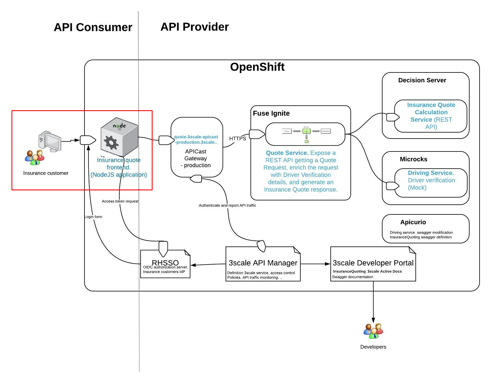
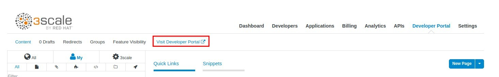
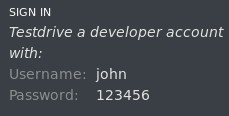
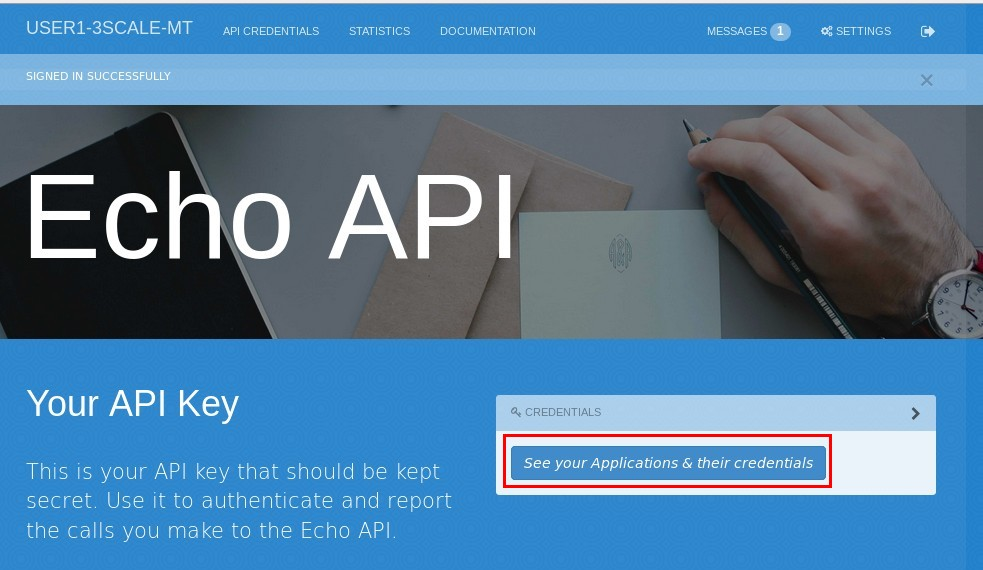
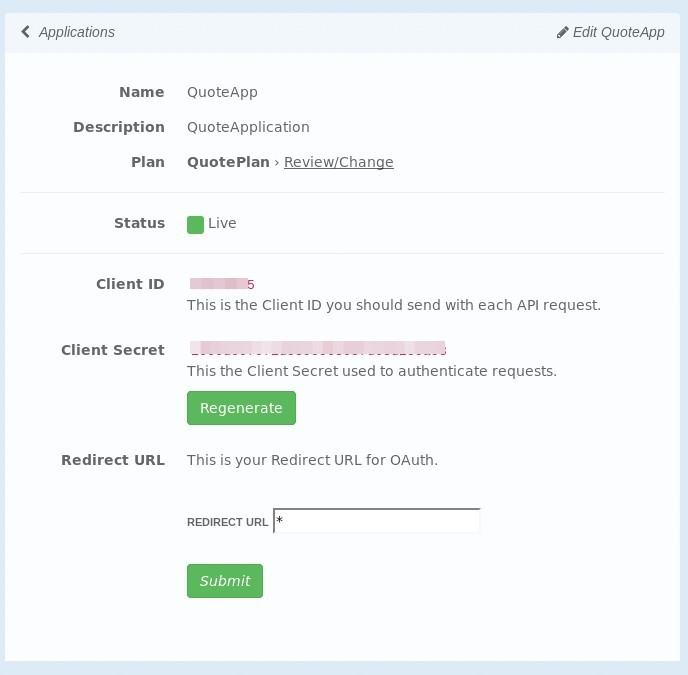
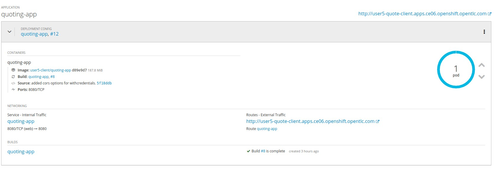
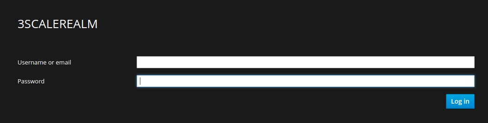
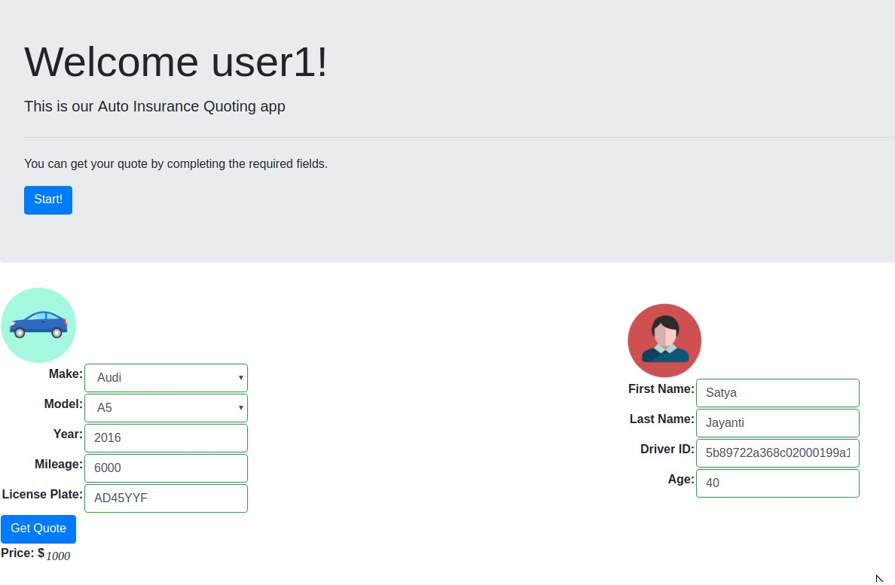

:noaudio:
:scrollbar:
:data-uri:
:toc2:
:linkattrs:

== Introduction

In this lab, you will be deploying the Quoting consumer NodeJS application, and making some test requests to the API configured in the previous lab.

.Goals
* Deploy the Client Web Application
* Access the Client Web Application

== Deploy Client Web Application

A code complete client NodeJS web application is provided for you in the lab assets. You need to configure and deploy this application. The web application provides a single page web app, which allows for SSO login to the app, a form to request an insurance quote, and presents the response back to the user.

=== Deploy 

. Open the 3scale Developer Portal
+
NOTE: You can click on the link *Visit Developer Portal* in 3scale admin console.
+

+
IMPORTANT: Open the Developer Portal in a new tab. Preferred browser is *Mozilla Firefox*.

. Login as default user (*john/123456*)
+

. Click on *See your Applications & their credentials* link.
+

. Click on the *QuoteApp* application.
. Copy the *Client ID* and *Client secret* to a text editor. You will need it in the next step.
+

. Open the browser window where you logged in to OpenShift Web Console.
. Select the project *$OCP_USERNAME-client*
. Click on *Select from Project.*
. Select *openshift* project.
. Select the *quoting-app* template.
. Click *Next*.
. Click *Next.*
. Select *Create Project.*
. Enter "*quoting-app*" as the *Project Name*
. Enter *"Quoting WebApp"* as the *Project Display Name.*
. Enter the following parameters:
+
.Parameters
[options="header"]
|=======================
| Parameter | Value
| *Application Hostname* | $OCP_USERNAME-quote-client.$OCP_SUFFIX
| *Quotes API URL* | https://$OCP_USERNAME-3scale-mt-api0.$OCP_SUFFIX/swagger/spec/quotes.json
| *Quotes API Client Secret* | &lt;Paste Client ID from 3scale&gt;
| *Quotes API ClientID* | &lt;Paste Client Secret from 3scale&gt;
| *RH Single Sign-On URL* | http://$OCP_USERNAME-sso-unsecured.$OCP_SUFFIX/auth
|=======================

. Click on the *Create* button.
. Check that the build and deployment is successful and the quote app is running successfully.
+

== Access Client Web Application

. Go to http://$OCP_USERNAME-quote-client.$OCP_SUFFIX
. Notice that you are redirected to the SSO login page.
. Login with the userid & password which you created in the previous lab. (*user1/password*)
+

. Click on the *Start* button.
. Open a new browser tab and go to http://microcks.$OCP_SUFFIX/#/services
. Use a valid resource id from the *Microcks* resources in the *Driver ID* field.
. Complete the form with any data of your choosing.
+
image::images/quote-app-form.png[]

. Click on the *Get Quote* button.
. You should receive an Insurance Quote pricing!
+

Congratulations, you have completed the lab.
