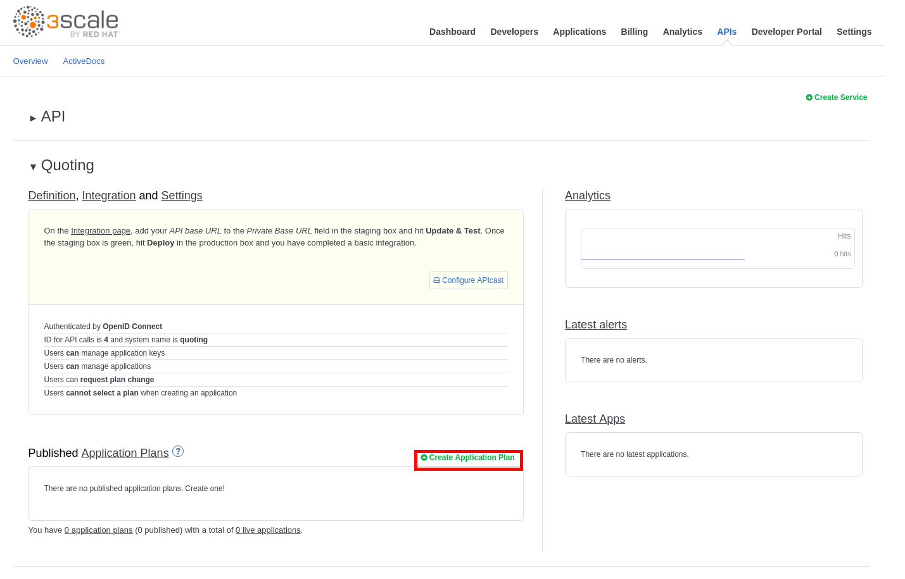
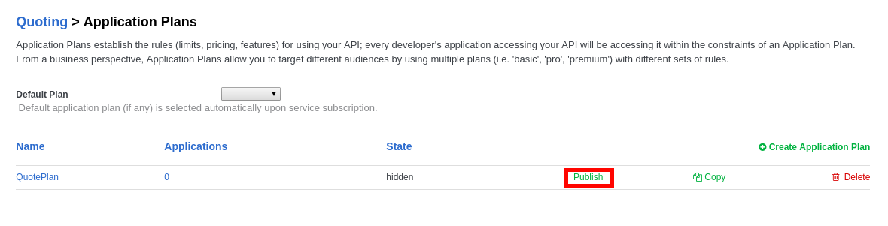
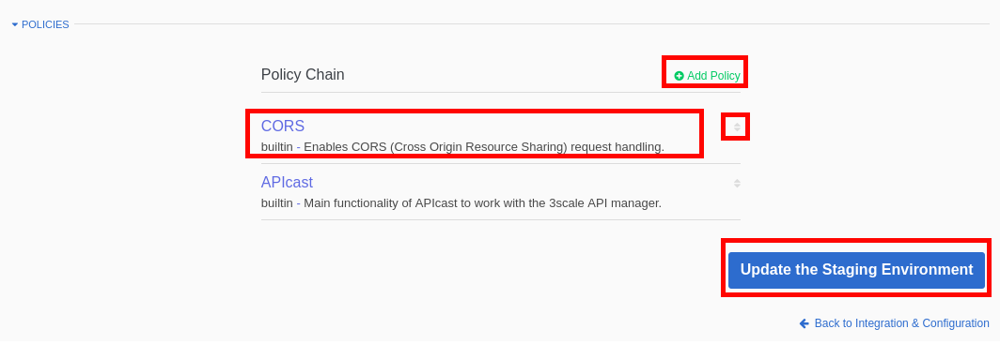
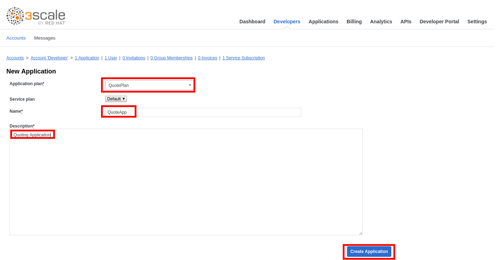

## Create the API

* Go to **3scale admin console** : https://3scale-admin.3scale.REPLACE_SUFFIX
* Login as admin/admin.
* Click on the **APIs** tab.
* Click on **Create Service**.
* Enter the following values:
** **Name**: Quoting
** **System name**: quoting
* Select **OpenID Connect** as Authentication mechanism.
* Click on the **Create Service** button.
* Click on **Create Application Plan** under the **Quoting** API.
+

* Enter the following values:
** **Name: **QuotePlan
** **System Name: **quote\_plan
* Click on the **Create Application Plan** button.
* Click on the **Publish** link.
+

* Click on the **Integration** tab.
* Click on the** add the base URL of your API and save the configuration** button.
* Enter the following:

**  **Private Base URL: **http://i-drivers-ignite.apps.ocp39pablo.rhtechofficelatam.com/REPLACE\_SUFFIX

* Expand the **Mapping Rules** section.

* Click on the **pencil icon** next to the mapping rule.

* Set the **Verb** to **POST.**

* Set the **Pattern **to **/webhook/quoteAPI**
+
image::images/3scale-quoteAPI.png[]

* Expand the **Authentication Settings** section.
* Enter:
** **OpenID Connect Issuer: **http://3scale-client:<your secret&gt;@sso-unsecured.REPLACE\_SUFFIX/auth/realms/3scaleRealm
* Select ** HTTP Headers** in the **Credentials Location.**
+
image::images/3scale-QuoteAPI-Auth.png[]

* Expand the **Policies** section.
* Click on **Add Policy.**
* Click on **CORS**.
* Drag the **CORS **policy to the top (before **APIcast**).
* Click on the **Update the Staging Environment** button.
+

* Click on the **Back to Integration and Configuration** link.
* Click on the **Promote v.1 to Production **button.

* Click on the **Developers** tab.

* Click on the **Developer** account.

* Click on the **1 Application** breadcrumb

* Click on **Create Application.**
+
image::images/3scale-createApp.png[]

* Make sure **Application Plan **is set to **QuotePlan**.
* Enter **QuoteApp** as **Name.**
* Enter **Quoting Application** as **Description.**
* Click on the **Create Application** button.
+

* Click on **Change** next to **Redirect URL**, in the **API Credentials** section.
* Enter "\*".
* Click **OK**.
+
image::images/3scale-app-redirecturl.png[]

* Click on the **APIs** tab.
* Click on the **ActiveDocs **tab.
* Click on **Creae a new spec.**
* Enter the following values:
** **Name: **Quotes
** **System name:** quotes
** **Publish: **checked
* Paste the contents of the **Labs\QuotingAPI.json** file.

* Correct the **host** property to match your environment: quote-3scale-apicast-production.3scale.REPLACE\_SUFFIX:443

* Click on the **Create Service **button.

* Go back to the RH-SSO console https://sso-rh-sso.REPLACE_SUFFX/auth

* Login as admin/password
* Make sure the **3scaleRealm **realm is selected.
* Click on the **Clients** tab.
* Click on the **Client ID** generated in 3scale.
* Scroll down to **Web Origins**.
* Enter an "\*" .
* Click on the **Save** button.
+
image::images/3scale-rhsso-client-weborigin.png[]

