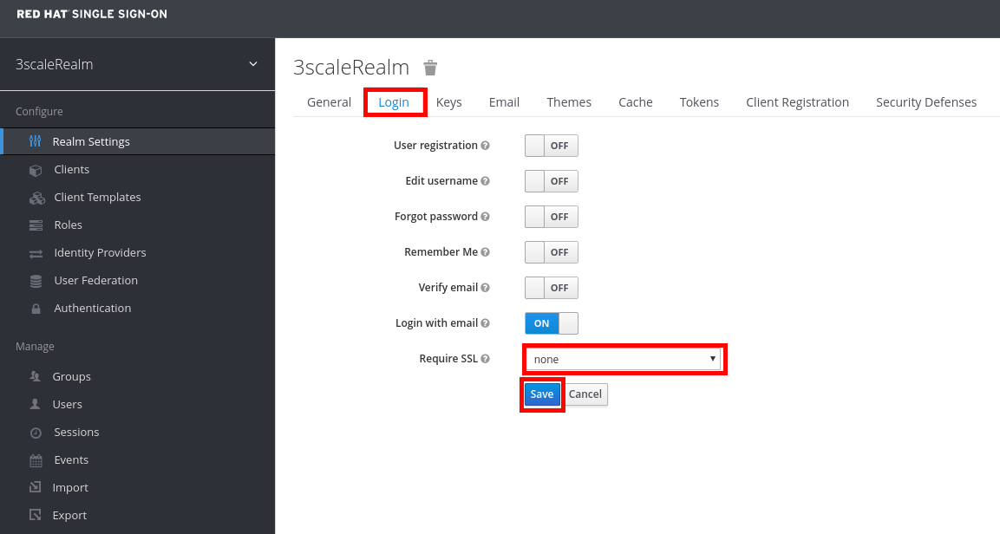

## Setup RH-SSO

* Go to https://sso-rh-sso.REPLACE_SUFFX/auth
* Login as admin/password
* Make sure the **3scaleRealm **realm is selected.
* Click on the **Login **tab.
* Click on the **Save **button.
* Select **none **for the **Require SSL **field.
+

* Click on **Clients. **
* Click on the **Create **button.
+
image::images/ssosetup-CreateClient.png[]

* Enter the following values:
** **Client ID**: 3scale-client
** **Client Protocol**: openid-connect
* Click on the **Save** button.
+
image::images/sso-setup-Client2.png[]

* Set the following parameters:
+
.Parameters
[options="header"]
|=======================
| Parameter | Value 
| **Access Type** | confidential 
| **Standard Flow Enabled** | OFF 
| **Direct Access Grants Enabled** | OFF 
| **Service Accounts Enabled** | ON 
|=======================

* Click on the **Save **button.
+
image::images/sso-setup3scaleclient.png[]

* Click on the **Service Account Roles **tab.
* Select** realm-management **in the **Client Roles** drop-down.
* Select **manage-clients** in the **Available Roles** list.
* Click on the **Add selected &gt;&gt;** button.
+
image::images/sso-setup-configure3scaleClient.png[]

* Click on the **Credentials** tab.

* Take note of the **Secret**, you will need it later.
+
image::images/sso-setup-3scaleclient-secret.png[]

* Click on **Users** \(under **Manage**\).

* Click on the **Add user** button.
+
image::images/sso-setup-3scale-adduser.png[]

* Enter **user1** as the **Username.**

* Click on the **Save** button.
+
image::images/sso-setup-adduser.png[]

* Click on the **Credentials** tab.

* Enter "password" as **New** **Password** and **Password** **Confirmation**.

* Set **Temporary** to **OFF**.

* Click on the **Reset** **Password** button.
+
image::images/sso-setup-resetpwd.png[]

* Accept the warning.

