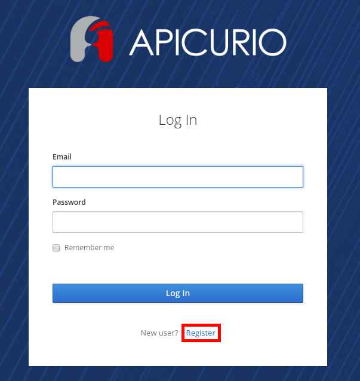
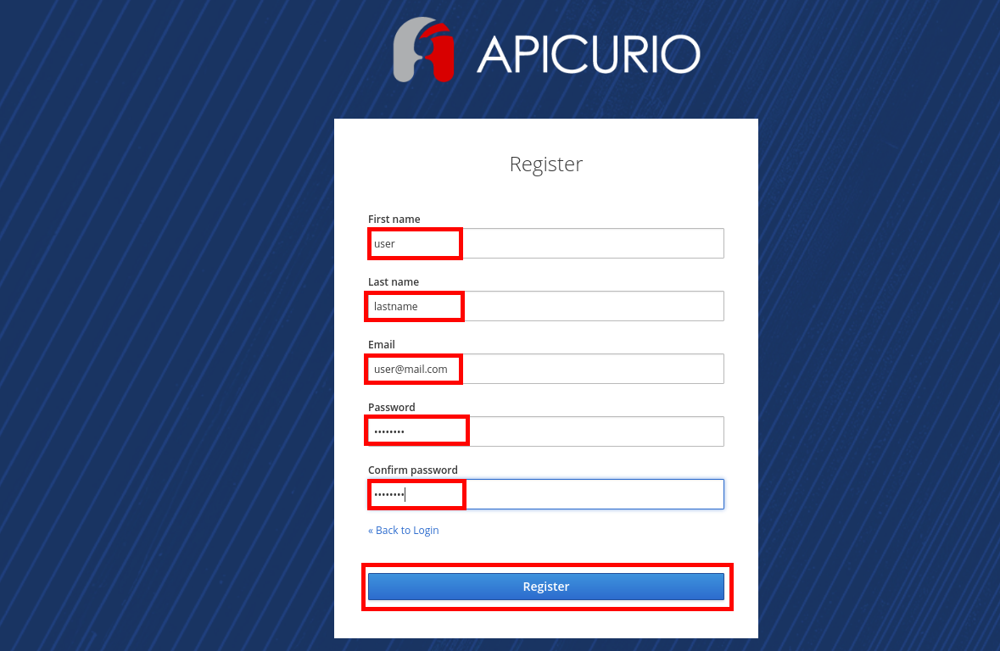
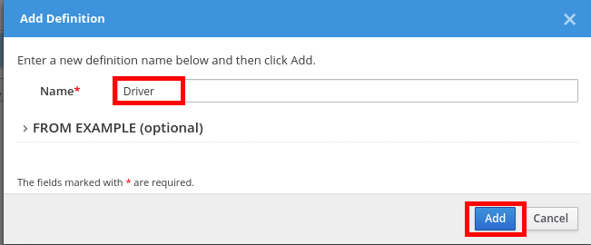
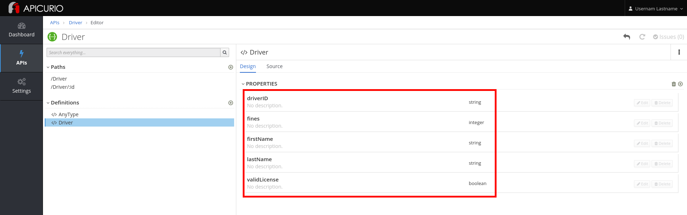
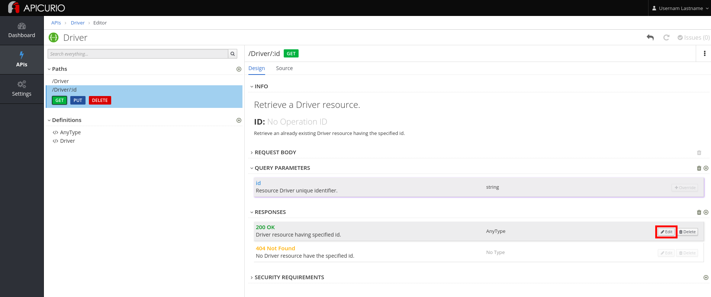

* Go to [http://apicurio.REPLACE\_SUFFIX](http://apicurio.REPLACE_SUFFIX)
* Click on the **Register** link.

* Complete the form with the following values:  
  | Parameter | Value |
  | :--- | :--- |
  | **First Name** | Username |
  | **Last Name** | Lastname |
  | **Email** | [user@mail.com](mailto:user@mail.com) |
  | **Password** | password |
  | **Confirm Password** | password |

* Click on the **Register **button.

* Click on the** Import API** button.  
  

* Enter the URL copied in the previous step.

* Click on the **Import API** button.

* Click on the **Edit API** button.

* Click on the **Add** button in the **Definitions **section**.**

* Enter **Driver** and click on the **Add** button.

* Add the following properties:

| Property name | Type |
| :--- | :--- |
| driverID | String |
| firstName | String |
| lastName | String |
| fines | Integer |
| validLicense | Boolean |

* Click on the **/Driver/:id** path.
* Click on the **GET** operation.

* Click on the **Edit** button next to the **200 OK** Response, in the **Responses **section.

* Select **Driver** as the **Type.**

* Click on the **OK** button.

* Click on **Driver** in the breadcrumb.

* Click on the three dots in the **Driver **API, and select **Download \(JSON\)**.

* Save the file to your disk.

